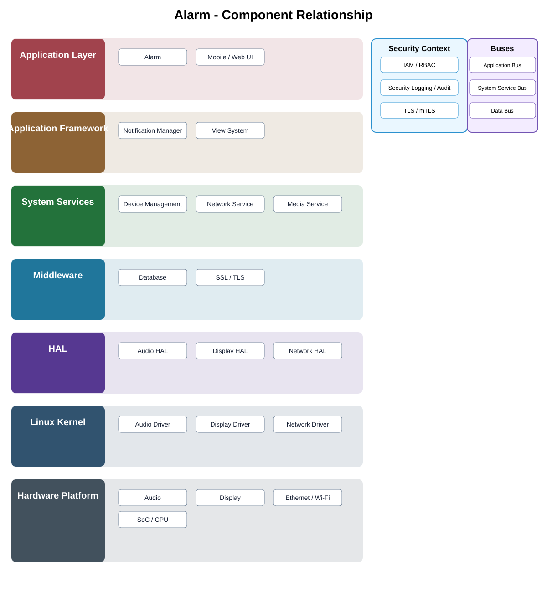

# Alarm Detailed Design

## Component

`alarm`

## Purpose

presents security alarms and alert state to authorized users and coordinates acknowledgement and escalation through approved services.

## Relationship overview

## Relevant system path

### Application Layer
- Alarm
- Mobile / Web UI

### Application Framework
- Notification Manager
- View System

### System Services
- Device Management
- Network Service
- Media Service

### Middleware
- Database
- SSL / TLS

### HAL
- Audio HAL
- Display HAL
- Network HAL

### Linux Kernel
- Audio Driver
- Display Driver
- Network Driver

### Hardware Platform
- Audio
- Display
- Ethernet / Wi-Fi
- SoC / CPU

## Communication boundaries

- Application Bus
- System Service Bus
- Data Bus

## Security context

- IAM / RBAC
- Security Logging / Audit
- TLS / mTLS

## Dependency rules

- Use approved APIs and buses rather than bypassing layer ownership.
- Application logic shall not absorb lower-layer implementation responsibilities.
- Vendor-specific details remain behind the owning abstraction boundary.
- Another component's private `src/` directory is not a supported dependency surface.

## Failure behavior

- notification delivery failure
- device offline
- authorization failure
- stale alarm state

## Open detailed-design topics

- final API contract and data model
- timing, concurrency, and lifecycle behavior
- observability and audit events
- component-specific performance limits

## Changelog

- 2026-10-03: Added component-specific detailed design and relationship diagram.
