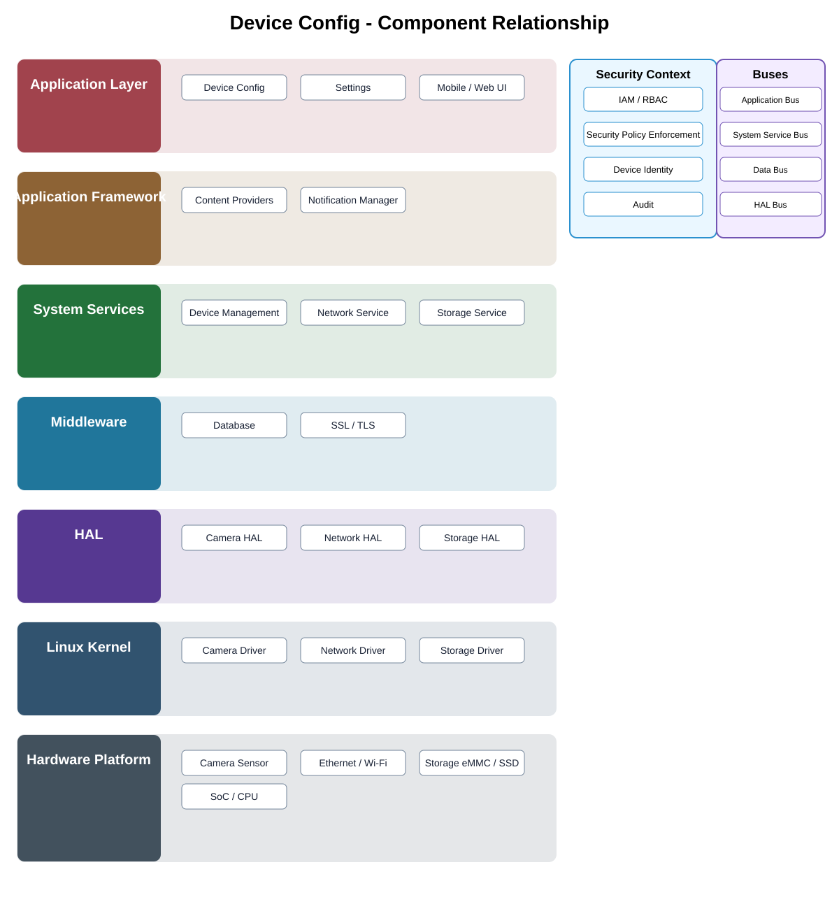

# Device Config Detailed Design — Platform Baseline v2

## Status
Revised against PR #77.

## Deployment placement
**Client editor + Camera apply/validation; optional Gateway/Backend synchronization**

## Purpose and ownership
Separate the user-facing editor from device-side validation/application and from Product Profile/build configuration.

## Product-owned contract
DeviceConfiguration contract with desired/applied state, revision, capability model, validation result, and reconciliation status.

## Relationship overview

## Review-driven decisions
- Capability-aware settings are explicit.
- Desired state and applied state are separate.
- Concurrent edits use revision conflict detection.
- Atomic versus partial apply is declared per setting group.
- Rollback and offline reconciliation are defined.
- Hardware-specific settings stay behind approved adapters.

## Interaction model
- product commands use versioned contracts;
- state and durable events are explicit;
- provider/platform details remain behind adapters;
- deployment transport is selected by Product Profile.

## Security
- authorization is enforced where the protected action occurs;
- standalone camera security remains explicit;
- credentials are held through approved client/device security providers;
- security-relevant actions are auditable.

## Decisions
- Client OS/hardware and camera OS/hardware are separate deployment concerns.
- Product Profile selects optional capabilities and placement.
- Private implementation directories are not dependency surfaces.

## Open decisions
- exact platform adapter technologies;
- product-specific retry, timeout, and resource budgets.

## Design acceptance criteria
1. A client can edit desired state without direct hardware access.
2. Stale revision writes are rejected or reconciled deterministically.
3. Partial apply produces explicit per-field status.
4. Offline camera changes reconcile according to defined precedence.
5. Product Profile cannot be modified through ordinary device configuration.

## Changelog
- 2026-10-04: Reworked for Platform Architecture Baseline v2 and review feedback.
