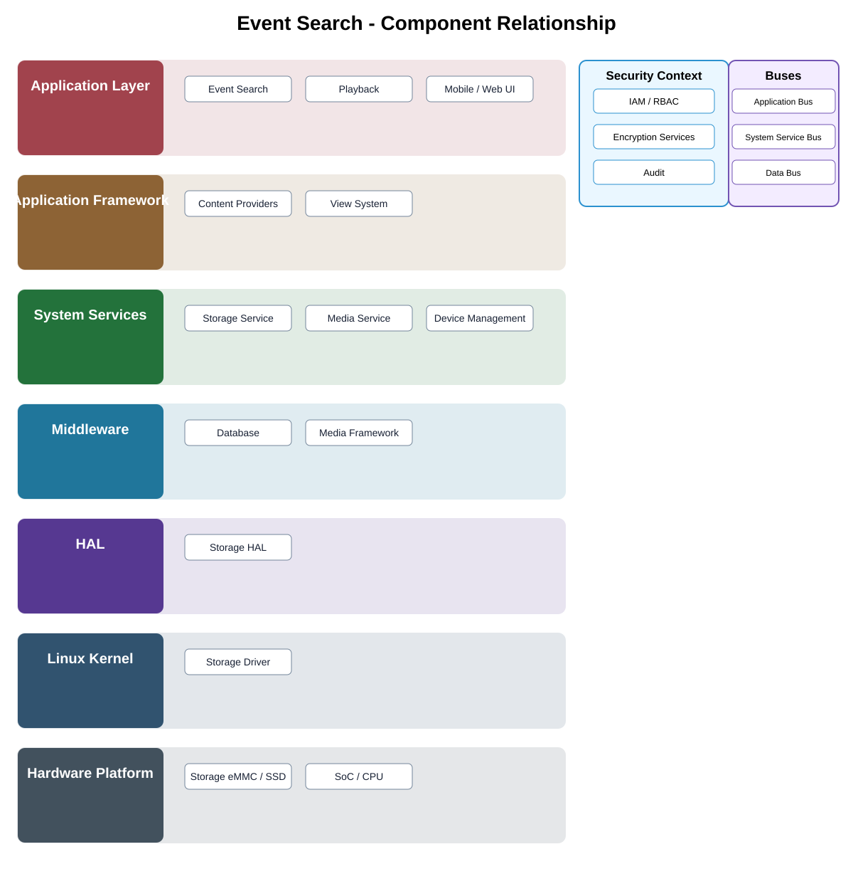

# Event Search Detailed Design

## Component

`event_search`

## Purpose

searches and filters recorded security events and links result metadata to playback or investigation workflows.

## Relationship overview

## Relevant system path

### Application Layer
- Event Search
- Playback
- Mobile / Web UI

### Application Framework
- Content Providers
- View System

### System Services
- Storage Service
- Media Service
- Device Management

### Middleware
- Database
- Media Framework

### HAL
- Storage HAL

### Linux Kernel
- Storage Driver

### Hardware Platform
- Storage eMMC / SSD
- SoC / CPU

## Communication boundaries

- Application Bus
- System Service Bus
- Data Bus

## Security context

- IAM / RBAC
- Encryption Services
- Audit

## Dependency rules

- Use approved APIs and buses rather than bypassing layer ownership.
- Application logic shall not absorb lower-layer implementation responsibilities.
- Vendor-specific details remain behind the owning abstraction boundary.
- Another component's private `src/` directory is not a supported dependency surface.

## Failure behavior

- index unavailable
- query timeout
- recording deleted
- authorization failure

## Open detailed-design topics

- final API contract and data model
- timing, concurrency, and lifecycle behavior
- observability and audit events
- component-specific performance limits

## Changelog

- 2026-10-03: Added component-specific detailed design and relationship diagram.
