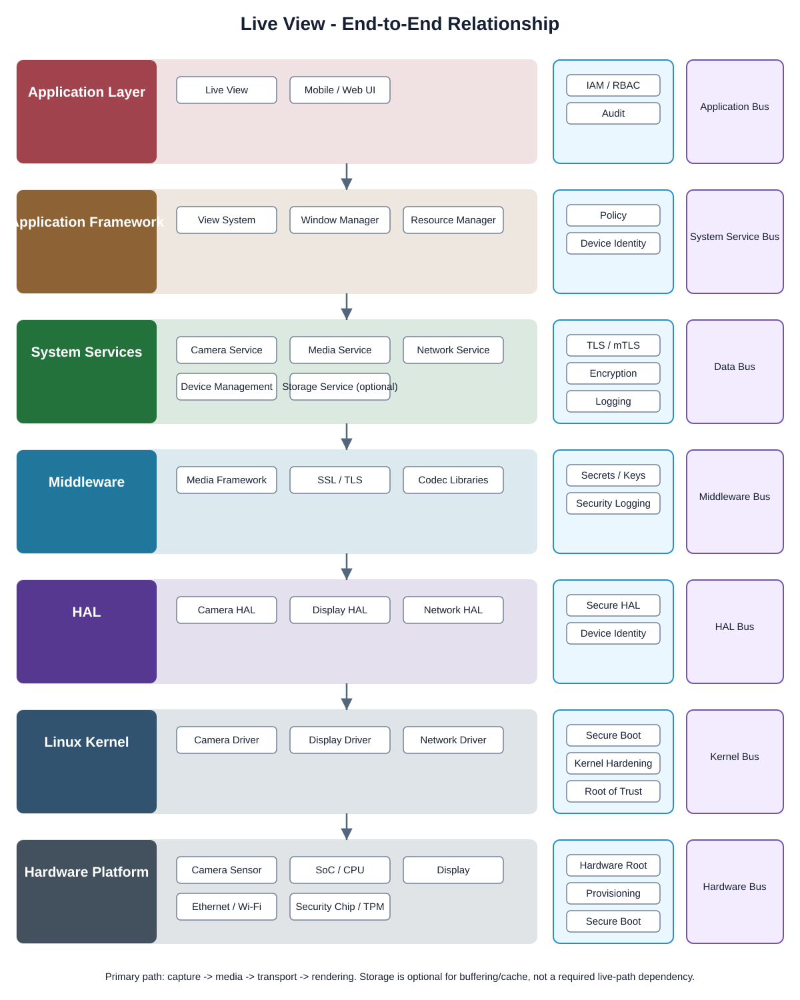

# Live View Detailed Design

## Component

`live_view`

## Purpose

The Live View component provides authorized users with a real-time video viewing experience while keeping application logic separated from media, platform, kernel, and hardware implementation details.

## Relationship overview

## End-to-end relationship

### Application Layer
- `live_view` owns live-view session state, user actions, and presentation behavior.
- `mobile_web_ui` presents the video surface and user controls.

### Application Framework
- `view_system` provides the rendering/view primitives.
- `window_manager` provides display surface and lifecycle coordination.
- `resource_manager` provides managed access to UI resources.

### System Services
- `camera_service` owns camera capture-session control.
- `media_service` coordinates the live media pipeline.
- `network_service` supports remote live-stream transport.
- `device_management` provides device state and health context.
- `storage_service` is optional for buffering/cache behavior and must not become a hard dependency of the normal low-latency path.

### Middleware
- `media_framework` provides media buffers and pipeline primitives.
- `ssl_tls` provides secured transport primitives where the viewing path crosses a protected network boundary.
- `codec_libraries` provide codec support where encode/decode support is needed.

### Hardware Abstraction Layer
- `camera_hal` abstracts camera and image-pipeline vendor details.
- `display_hal` abstracts local display behavior where applicable.
- `network_hal` abstracts vendor network interfaces.

### Linux Kernel
- `camera_driver` provides low-level camera device access.
- `display_driver` provides low-level local display access where applicable.
- `network_driver` provides low-level network device access.

### Hardware Platform
- `camera_sensor` is the image source.
- `soc_cpu` executes the capture and media software path.
- `display` is used for local rendering when the product includes a display.
- `network_ethernet_wifi` provides remote transport.
- `security_chip_tpm_hsm` provides hardware-backed trust material where required.

## Communication boundaries

Live View must use the approved boundaries rather than bypassing layers:

- `application_bus`
- `system_service_bus`
- `data_bus`
- `middleware_bus`
- `hal_bus`
- `kernel_bus`
- `hardware_bus`

## Security context

Relevant security services include:

- `iam`
- `rbac`
- `device_identity`
- `tls_mtls`
- `encryption_services`
- `security_logging_audit`
- `secure_hal_interface`
- `secure_boot_measured_boot`
- `kernel_hardening`
- `hardware_root_of_trust`

## Dependency rules

- Live View must not directly call HAL, kernel drivers, or hardware.
- Application code depends on approved framework/service APIs.
- Vendor-specific implementation remains behind HAL/service abstraction boundaries.
- Another component's private `src/` directory is never a supported dependency surface.

## Failure behavior

The component must handle:
- camera capture unavailable
- media pipeline initialization failure
- network interruption and reconnect
- authorization failure
- display surface loss
- device shutdown/restart during an active session

## Open design items

- final live-stream transport protocol and negotiation flow
- latency target and buffer sizing
- reconnect and backoff policy
- local-display versus remote-streaming specialization
- multi-client session limits
- telemetry and performance metrics

## Changelog

- 2026-10-03: Added detailed end-to-end Live View relationship, dependency boundaries, security context, and failure behavior.
