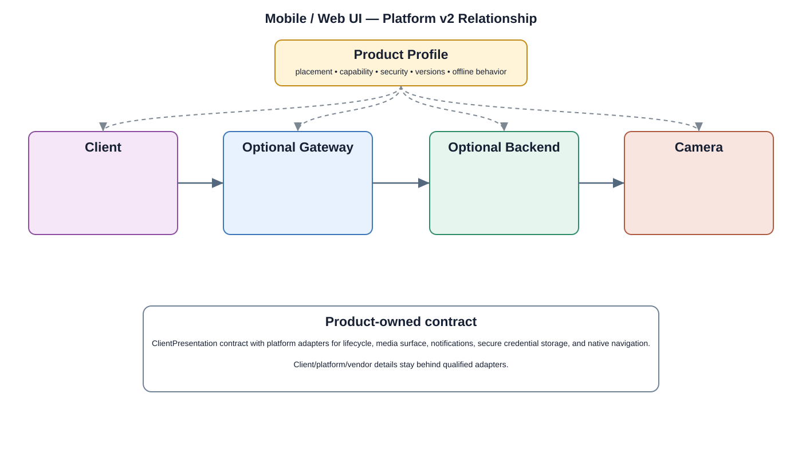

# Mobile / Web UI Detailed Design

## Component

`mobile_web_ui`

## Purpose

Provides the presentation shell for supported camera workflows without owning service or hardware logic.

## Relationship overview

## Relevant system path

### Application Layer
- Mobile / Web UI
- Live View
- Playback
- Alarm
- Settings

### Application Framework
- View System
- Window Manager
- Resource Manager
- Notification Manager

### System Services
- Media Service
- Network Service
- Device Management

### Middleware
- SSL / TLS
- Media Framework

### Hardware Platform
- SoC / CPU
- Display
- Ethernet / Wi-Fi

## Security context

- IAM / RBAC
- TLS / mTLS
- Security Policy
- Audit

## Communication boundaries

- Application Bus
- System Service Bus

## Dependency rules

- Use approved interfaces and buses; do not bypass owning layers.
- Keep lower-layer and vendor implementation details outside this component.
- Another component's private `src/` directory is not a dependency surface.

## Failure behavior

- session expiry
- network loss
- rendering failure

## Open design items

- final API and data contract
- lifecycle and concurrency behavior
- performance and observability limits

## Changelog

- 2026-10-03: Added detailed relationship design.
