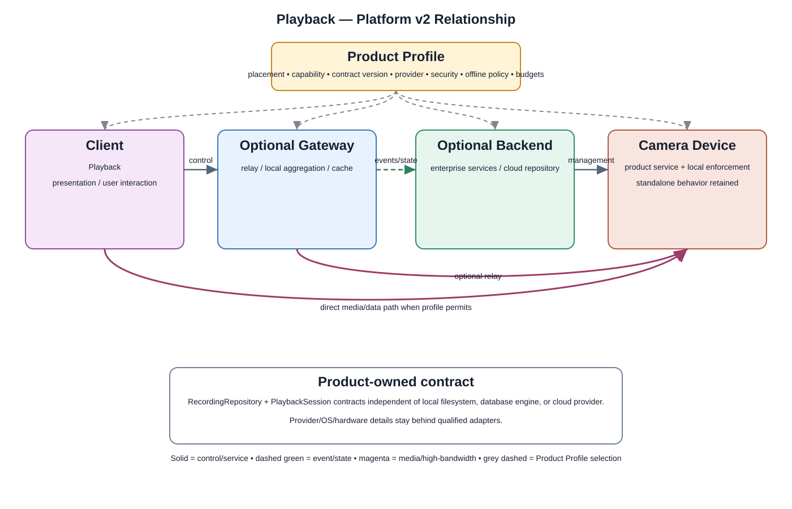

# Playback Detailed Design

## Component

`playback`

## Purpose

The Playback component provides authorized users with access to recorded video and event-associated media while keeping application behavior separated from media, storage, transport, kernel, and hardware implementation details.

## Relationship overview

## End-to-end relationship

### Application Layer
- `playback` owns playback session state, timeline navigation, seek/pause/resume actions, and error presentation.
- `mobile_web_ui` presents the recorded video surface, timeline, and controls.
- `event_search` may provide the event/time selection that starts a playback session.

### Application Framework
- `view_system` provides presentation primitives.
- `window_manager` provides the playback surface and lifecycle coordination.
- `content_providers` may expose structured metadata to the application through controlled access.
- `resource_manager` provides managed access to UI resources.

### System Services
- `storage_service` resolves and reads recorded media and associated metadata.
- `media_service` coordinates decode/playback pipeline state.
- `network_service` supports remote playback when media is retrieved or streamed over the network.
- `device_management` may provide device/storage health and availability context.

### Middleware
- `media_framework` provides demux, buffering, timing, and playback pipeline primitives.
- `codec_libraries` provide decode support.
- `database` provides indexed metadata, event-to-media mapping, or timeline lookup where applicable.
- `ssl_tls` provides secured transport primitives when media crosses a protected network boundary.

### Hardware Abstraction Layer
- `storage_hal` abstracts vendor-specific storage access.
- `display_hal` abstracts local display behavior where applicable.
- `network_hal` abstracts vendor-specific network interfaces.

### Linux Kernel
- `storage_driver` provides low-level storage access.
- `display_driver` provides local display access where applicable.
- `network_driver` provides low-level network access.

### Hardware Platform
- `storage_emmc_ssd` contains recorded media or local cache.
- `soc_cpu` executes the playback and decode path.
- `display` is used for local playback when present.
- `network_ethernet_wifi` provides remote retrieval/stream transport.
- `security_chip_tpm_hsm` provides hardware-backed trust material where required.

## Communication boundaries

Playback must use approved architecture boundaries:

- `application_bus`
- `system_service_bus`
- `data_bus`
- `middleware_bus`
- `hal_bus`
- `kernel_bus`
- `hardware_bus`

## Security context

Relevant security services include:

- `iam`
- `rbac`
- `device_identity`
- `tls_mtls`
- `encryption_services`
- `secrets_key_management`
- `security_logging_audit`
- `secure_hal_interface`
- `kernel_hardening`
- `hardware_root_of_trust`

## Dependency rules

- Playback must not directly access raw storage devices, drivers, or hardware.
- Recorded media retrieval must flow through approved storage/media service interfaces.
- UI code must not own codec, database, or storage implementation logic.
- Vendor-specific storage and display behavior remains behind HAL boundaries.
- Another component's private `src/` directory is never a supported dependency surface.

## Failure behavior

The component must handle:
- requested recording not found
- metadata/index lookup failure
- media file corruption or unsupported codec
- storage unavailable
- network interruption during remote playback
- authorization failure
- seek outside valid media range

## Open design items

- exact recording index format and lookup ownership
- local versus remote playback path specialization
- seek granularity and keyframe strategy
- buffering behavior and prefetch limits
- playback speed support
- retention interaction when a recording is deleted during playback
- integrity verification for recorded media

## Changelog

- 2026-10-03: Added detailed end-to-end Playback relationship, storage/media dependencies, security context, and failure behavior.
