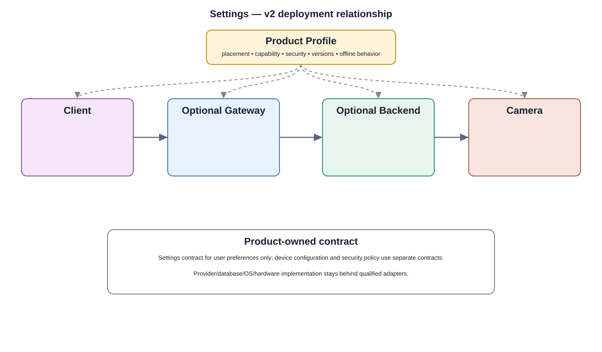

# Settings Detailed Design — Platform Baseline v2

## Status
Revised against PR #77.

## Deployment placement
**Client + Camera**

## Purpose and ownership
Separate application preferences from Product Profile, mandatory security policy, and device configuration.

## Product-owned contract
Settings contract for user preferences only; device configuration and security policy use separate contracts.

## Relationship overview

## Interaction model
- Commands use stable product contracts.
- State and durable domain events are separate from provider APIs.
- Deployment transport is selected by Product Profile.
- Provider and operating-system details remain behind adapters.

## Review-driven design decisions
- Application preferences, build/product profile, security policy, and device configuration have different owners and lifecycles.
- Versioned validation and authorization are required.
- Concurrent edits use revision/version checks.
- Persistence failure and rollback/partial-apply behavior are explicit.
- Mandatory security requirements cannot be disabled through ordinary settings.

## Product Profile inputs
- deployment placement and optional backend/gateway;
- capability and compatible contract versions;
- provider/adapter selection;
- security and offline policy.

## Security
- camera-side enforcement remains explicit for standalone operation;
- mandatory security policy cannot be disabled by ordinary preferences;
- protected operations are auditable.

## Decisions
- Shared product behavior is provider independent.
- Optional capabilities are profile-selected.
- No private `src/` dependency is a product contract.

## Open decisions
- exact provider/transport selections;
- profile-specific limits and retention/version policies.

## Design acceptance criteria
1. A user preference change cannot alter Product Profile or mandatory security policy.
2. Concurrent updates detect stale revisions.
3. Persistence failure leaves a defined previous/applied state.
4. Unsupported settings are rejected by capability-aware validation.

## Changelog
- 2026-10-04: Reworked for Platform Architecture Baseline v2 and review feedback.
