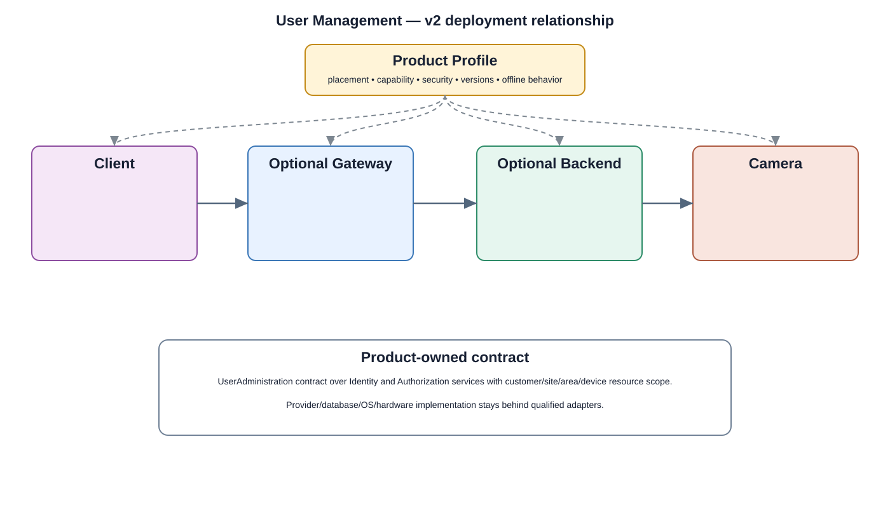

# User Management Detailed Design — Platform Baseline v2

## Status
Revised against PR #77.

## Deployment placement
**Client workflow + identity/authorization services; Camera retains local enforcement**

## Purpose and ownership
Treat user administration as a workflow over human identity and authorization contracts, separate from device identity and security hardware.

## Product-owned contract
UserAdministration contract over Identity and Authorization services with customer/site/area/device resource scope.

## Relationship overview

## Interaction model
- Commands use stable product contracts.
- State and durable domain events are separate from provider APIs.
- Deployment transport is selected by Product Profile.
- Provider and operating-system details remain behind adapters.

## Review-driven design decisions
- Human identity is separate from device identity.
- Customer/site/area/device scope and inheritance are explicit.
- Session revocation and concurrent administration are defined.
- Unavailable identity/audit service behavior is explicit.
- Authentication and MFA mechanisms are selected by security profile.

## Product Profile inputs
- deployment placement and optional backend/gateway;
- capability and compatible contract versions;
- provider/adapter selection;
- security and offline policy.

## Security
- camera-side enforcement remains explicit for standalone operation;
- mandatory security policy cannot be disabled by ordinary preferences;
- protected operations are auditable.

## Decisions
- Shared product behavior is provider independent.
- Optional capabilities are profile-selected.
- No private `src/` dependency is a product contract.

## Open decisions
- exact provider/transport selections;
- profile-specific limits and retention/version policies.

## Design acceptance criteria
1. Changing user roles does not require direct access to device keys or hardware.
2. Revocation propagates according to defined online/offline policy.
3. Concurrent administrators receive deterministic conflict behavior.
4. A standalone camera can enforce locally valid administration policy without backend.

## Changelog
- 2026-10-04: Reworked for Platform Architecture Baseline v2 and review feedback.
