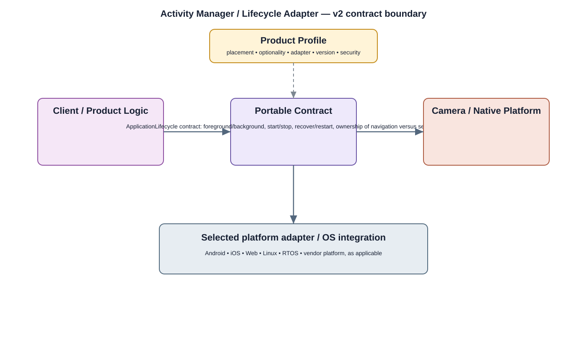

# Activity Manager Detailed Design

## Component

`activity_manager`

## Purpose

Coordinates application lifecycle and execution state so user-facing workflows start, stop, suspend, and recover predictably.

## Relationship overview

## Relevant system path

### Application Layer
- Live View
- Playback
- Alarm
- Settings

### Application Framework
- Activity Manager
- Window Manager
- Package Manager

### System Services
- Device Management

### Middleware
- Database

### Hardware Platform
- SoC / CPU
- Storage eMMC / SSD

## Security context

- Security Policy
- Audit

## Communication boundaries

- Application Bus
- System Service Bus

## Dependency rules

- Use approved interfaces and buses; do not bypass owning layers.
- Keep lower-layer and vendor implementation details outside this component.
- Another component's private `src/` directory is not a dependency surface.

## Failure behavior

- application crash
- resource exhaustion
- invalid lifecycle request

## Open design items

- final API and data contract
- lifecycle and concurrency behavior
- performance and observability limits

## Changelog

- 2026-10-03: Added detailed relationship design.
