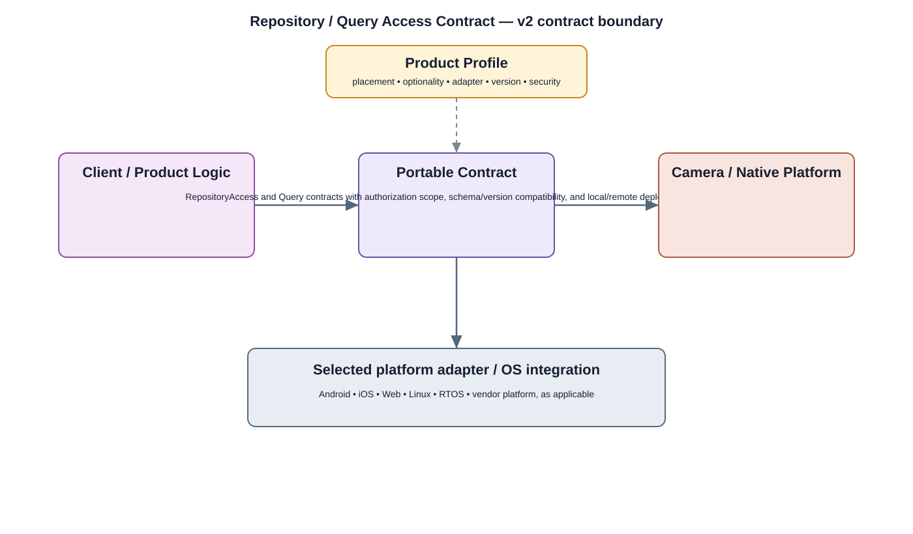

# Content Providers Detailed Design

## Component

`content_providers`

## Purpose

Provides controlled structured-data access between application components and owning services without exposing private persistence details.

## Relationship overview

## Relevant system path

### Application Layer
- Event Search
- Settings
- User Management

### Application Framework
- Content Providers

### System Services
- Storage Service
- Device Management

### Middleware
- Database

### HAL
- Storage HAL

### Linux Kernel
- Storage Driver

### Hardware Platform
- Storage eMMC / SSD

## Security context

- IAM / RBAC
- Security Policy
- Encryption
- Audit

## Communication boundaries

- Application Bus
- System Service Bus
- Data Bus

## Dependency rules

- Use approved interfaces and buses; do not bypass owning layers.
- Keep lower-layer and vendor implementation details outside this component.
- Another component's private `src/` directory is not a dependency surface.

## Failure behavior

- database unavailable
- authorization failure
- schema mismatch

## Open design items

- final API and data contract
- lifecycle and concurrency behavior
- performance and observability limits

## Changelog

- 2026-10-03: Added detailed relationship design.
