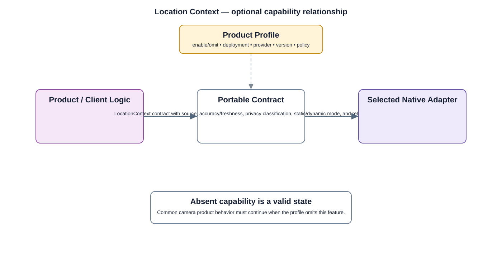

# Location Manager Detailed Design

## Component
`location_manager`

## Purpose
Provides controlled access to device or installation location context when supported or required by the product.

## Relationship overview

## Relevant system path

### Application Layer
- Settings
- Device Config
- Event Search
### Application Framework
- Location Manager
### System Services
- Device Management
- Network Service
### Middleware
- Database
- SSL / TLS
### Hardware Platform
- Ethernet / Wi-Fi
- Other Peripherals
- SoC / CPU

## Security context
- IAM / RBAC
- Security Policy
- Audit

## Communication boundaries
- Application Bus
- System Service Bus

## Dependency rules
- Use approved interfaces and buses.
- Keep lower-layer implementation details outside this component.
- Do not depend on another component's private `src/`.

## Failure behavior
- location unavailable
- stale location
- permission denied

## Changelog
- 2026-10-03: Added detailed relationship design.
