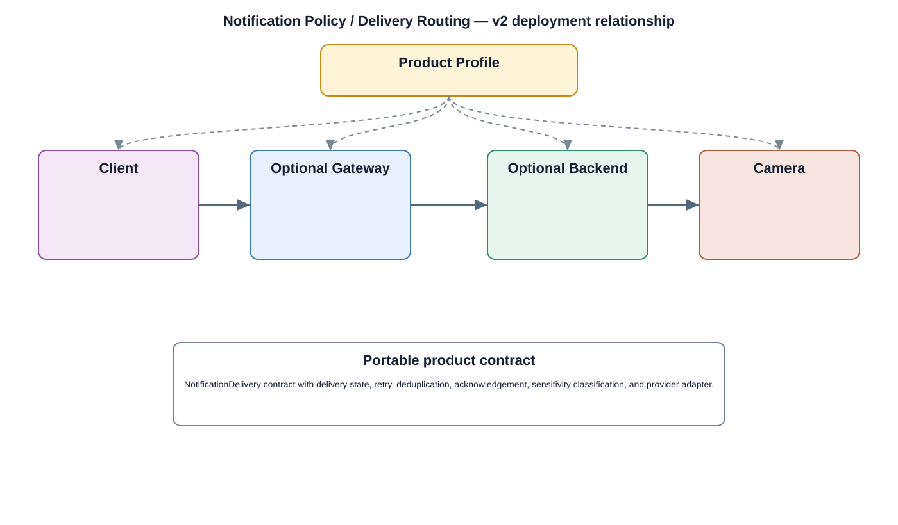

# Notification Policy / Delivery Routing Detailed Design — Platform Baseline v2

## Status
Revised against PR #77.

## Deployment placement
**Client + optional Gateway/Backend + optional local Camera output**

## Purpose and ownership
Separate notification policy/routing from Android/iOS/Web delivery adapters and optional camera-local audio/display outputs.

## Product-owned contract
NotificationDelivery contract with delivery state, retry, deduplication, acknowledgement, sensitivity classification, and provider adapter.

## Relationship overview

## Review-driven decisions
- Alarm domain owns alarm semantics; notification component owns delivery policy/state.
- Platform delivery adapters are replaceable.
- Local camera outputs are optional capabilities.
- Offline behavior and retry bounds are explicit.
- Sensitive content handling is defined per security/profile policy.

## Product Profile inputs
- capability optionality and placement;
- compatible contract version;
- selected platform/provider adapter;
- security, rollback/retry, and offline policy.

## Design rules
- portable product behavior is separated from native package/resource/notification mechanisms;
- client and camera lifecycles are distinct;
- mandatory security policy is not delegated to a convenience framework component.

## Open decisions
- provider/platform selection per profile;
- numerical retry, cache, retention, and compatibility limits.

## Design acceptance criteria
1. Alarm semantics remain unchanged when notification provider changes.
2. Remote-only products work without camera audio/display.
3. Duplicate notifications are bounded by deduplication policy.
4. Offline delivery transitions through defined pending/failed/expired states.

## Changelog
- 2026-10-04: Re-scoped for Platform Architecture Baseline v2 and review feedback.
