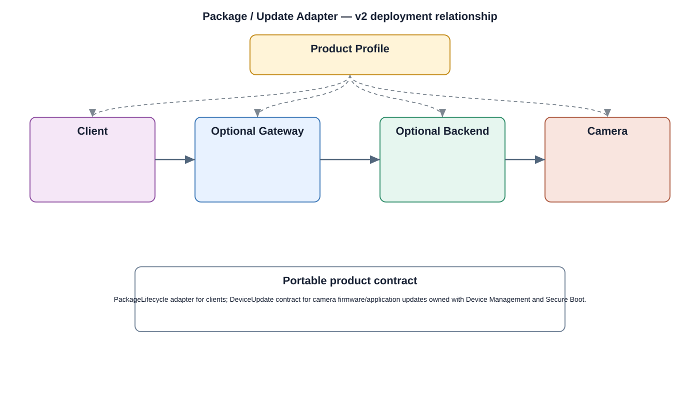

# Package / Update Adapter Detailed Design — Platform Baseline v2

## Status
Revised against PR #77.

## Deployment placement
**Client package platform adapter and/or Camera update integration, selected separately**

## Purpose and ownership
Separate client package lifecycle from camera firmware/application update orchestration. A generic package manager is not mandatory shared product logic.

## Product-owned contract
PackageLifecycle adapter for clients; DeviceUpdate contract for camera firmware/application updates owned with Device Management and Secure Boot.

## Relationship overview

## Review-driven decisions
- Client package lifecycle and device update lifecycle are separate.
- Update authenticity and compatibility are product/security obligations.
- Interrupted update recovery and approved rollback are explicit.
- Platform package mechanisms remain replaceable.
- Device Management owns orchestration; Secure Boot/verification owns trust enforcement.

## Product Profile inputs
- capability optionality and placement;
- compatible contract version;
- selected platform/provider adapter;
- security, rollback/retry, and offline policy.

## Design rules
- portable product behavior is separated from native package/resource/notification mechanisms;
- client and camera lifecycles are distinct;
- mandatory security policy is not delegated to a convenience framework component.

## Open decisions
- provider/platform selection per profile;
- numerical retry, cache, retention, and compatibility limits.

## Design acceptance criteria
1. A product can use native client package mechanisms without camera dependency.
2. Camera update remains valid without Android-style Package Manager.
3. Interrupted update has a deterministic recovery state.
4. Unauthorized or incompatible update is rejected before activation.

## Changelog
- 2026-10-04: Re-scoped for Platform Architecture Baseline v2 and review feedback.
