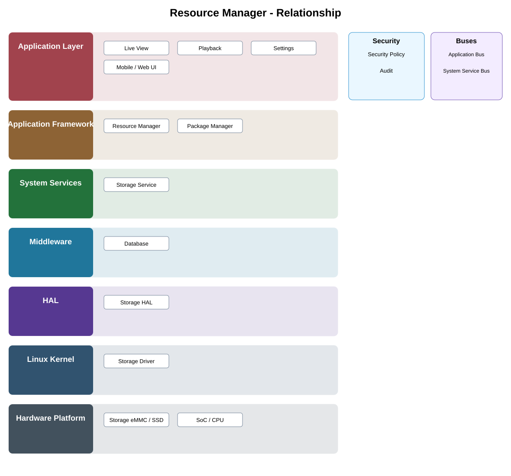

# Resource Manager Detailed Design

## Component
`resource_manager`

## Purpose
Provides managed access to packaged resources and configuration-dependent assets for application components.

## Relationship overview

## Relevant system path

### Application Layer
- Live View
- Playback
- Settings
- Mobile / Web UI
### Application Framework
- Resource Manager
- Package Manager
### System Services
- Storage Service
### Middleware
- Database
### HAL
- Storage HAL
### Linux Kernel
- Storage Driver
### Hardware Platform
- Storage eMMC / SSD
- SoC / CPU

## Security context
- Security Policy
- Audit

## Communication boundaries
- Application Bus
- System Service Bus

## Dependency rules
- Use approved interfaces and buses.
- Keep lower-layer implementation details outside this component.
- Do not depend on another component's private `src/`.

## Failure behavior
- resource missing
- storage unavailable
- package metadata mismatch

## Changelog
- 2026-10-03: Added detailed relationship design.
