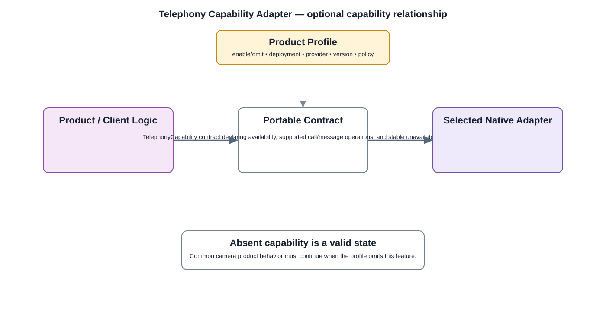

# Telephony Capability Adapter Detailed Design — Platform Baseline v2

## Status
Revised against PR #77.

## Deployment placement
**Optional client/platform or gateway capability only when selected by Product Profile**

## Purpose and ownership
Keep telephony out of the common camera core and separate cellular connectivity from calls/messages and from notification delivery.

## Product-owned contract
TelephonyCapability contract declaring availability, supported call/message operations, and stable unavailable behavior.

## Relationship overview

## Review-driven decisions
- Telephony is explicitly optional.
- Cellular data connectivity belongs to networking; calls/messages are a separate capability.
- Notification delivery remains separate from telephony.
- Absence is a normal supported state.
- Provider/modem APIs remain behind adapters.

## Product Profile inputs
- capability optionality and deployment;
- provider/platform adapter;
- compatible contract version;
- privacy/security/offline behavior.

## Design rules
- optional platform capabilities do not become dependencies of the common camera core;
- portable state/contracts remain independent of native SDK types;
- headless/feature-absent products remain valid.

## Design acceptance criteria
1. Core camera behavior works with telephony absent.
2. A profile can enable cellular data without enabling calls/messages.
3. Provider replacement does not alter product-level telephony semantics.
4. Requirement IDs are globally unique.

## Open decisions
- exact native/provider adapter selections;
- profile-specific capability limits.

## Changelog
- 2026-10-04: Re-scoped for Platform Architecture Baseline v2 and review feedback.
