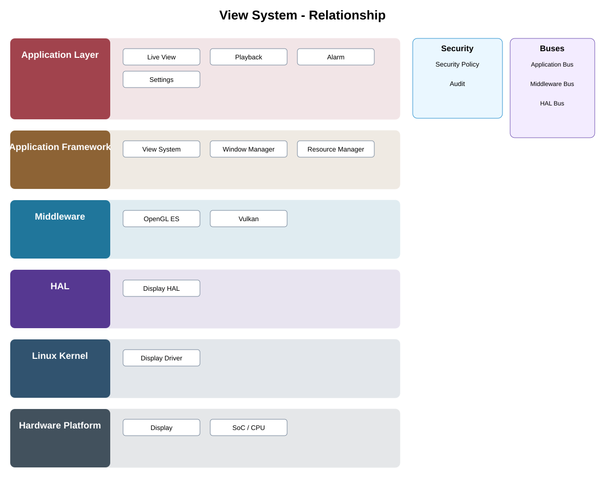

# Presentation State / Media Surface Contract Detailed Design — Platform Baseline v2

## Status
Revised against PR #77.

## Deployment placement
**Client presentation; optional camera-local display adapter only when profile enables local display**

## Purpose and ownership
Re-scope view/layout/rendering away from shared camera middleware into client presentation and optional local-display adapters.

## Product-owned contract
PresentationState + MediaSurface contracts mapped to native client/platform rendering systems.

## Relationship overview

## Review-driven decisions
- Shared camera middleware does not own a cross-platform windowing toolkit.
- Presentation state is portable; rendering implementation is native.
- Media surface contract is separate from graphics backend.
- OpenGL ES/Vulkan are optional adapters.
- Headless cameras omit local presentation.

## Product Profile inputs
- capability optionality and deployment;
- provider/platform adapter;
- compatible contract version;
- privacy/security/offline behavior.

## Design rules
- optional platform capabilities do not become dependencies of the common camera core;
- portable state/contracts remain independent of native SDK types;
- headless/feature-absent products remain valid.

## Design acceptance criteria
1. Android/iOS/Web map presentation state to native UI frameworks.
2. Headless camera profile has no presentation dependency.
3. Graphics backend can change without changing shared product behavior.
4. Media surface lifecycle is deterministic.

## Open decisions
- exact native/provider adapter selections;
- profile-specific capability limits.

## Changelog
- 2026-10-04: Re-scoped for Platform Architecture Baseline v2 and review feedback.
