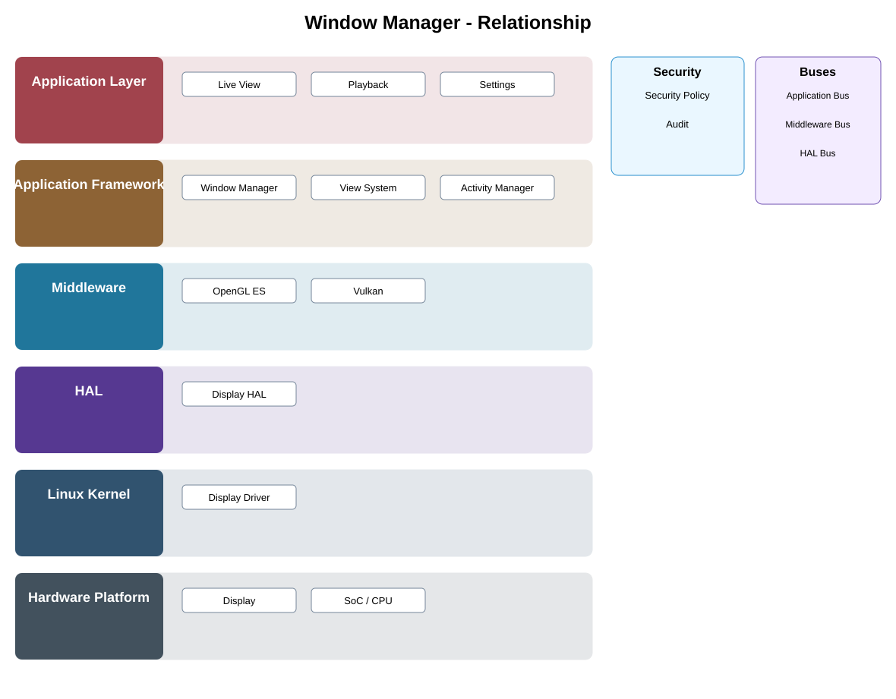

# Window Manager / Surface Adapter Detailed Design — Platform Baseline v2

## Status
Revised against PR #77.

## Deployment placement
**Client platform adapter or optional camera-local display adapter**

## Purpose and ownership
Make window/surface management optional and deployment-specific; it is not a universal camera-platform service.

## Product-owned contract
SurfaceLifecycle contract: create/bind/show/hide/resize/release surface with capability and failure state.

## Relationship overview

## Review-driven decisions
- Remote client display hardware is separate from camera hardware.
- Headless cameras omit the component.
- Local display support is selected by Product Profile.
- Native Android/iOS/Web/local-display mechanisms implement the portable surface contract.
- Graphics backend choice stays below the presentation contract.

## Product Profile inputs
- whether this capability exists in the product;
- deployment placement and compatible contract version;
- selected native/platform adapter;
- security and offline behavior.

## Design rules
- platform/framework names do not imply a mandatory Android implementation;
- portable contracts remain smaller than native platform APIs;
- client and camera platform concerns are separated;
- private/provider implementation is not exposed upward.

## Security
- caller identity and authorization are enforced at protected operations;
- security-relevant lifecycle/data actions are auditable;
- standalone camera behavior does not depend on backend availability.

## Open decisions
- native adapter choices per supported platform;
- exact compatibility/versioning and resource limits.

## Design acceptance criteria
1. Remote clients render without depending on camera display/window services.
2. Headless product profiles contain no window/display dependency.
3. Surface loss and recreation are deterministic.
4. Switching graphics backend does not change upper presentation semantics.

## Changelog
- 2026-10-04: Re-scoped for Platform Architecture Baseline v2 and review feedback.
