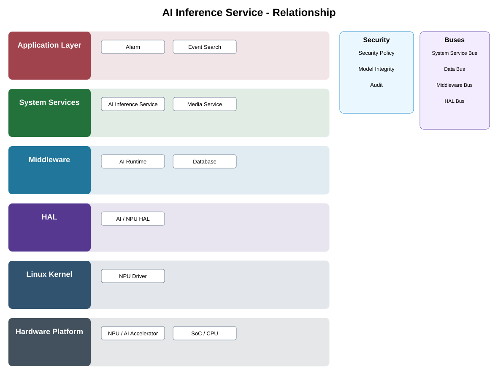

# AI Inference Service Detailed Design

## Component
`ai_inference_service`

## Purpose
Provides a common service boundary for executing approved AI models and returning inference results without exposing accelerator-specific details.

## Relationship overview

## Relevant system path

### Application Layer
- Alarm
- Event Search
### System Services
- AI Inference Service
- Media Service
### Middleware
- AI Runtime
- Database
### HAL
- AI / NPU HAL
### Linux Kernel
- NPU Driver
### Hardware Platform
- NPU / AI Accelerator
- SoC / CPU

## Security context
- Security Policy
- Model Integrity
- Audit

## Communication boundaries
- System Service Bus
- Data Bus
- Middleware Bus
- HAL Bus

## Dependency rules
- Use approved interfaces and buses.
- Keep vendor and lower-layer implementation behind owning boundaries.
- Do not depend on another component's private `src/`.

## Failure behavior
- model unavailable
- accelerator unavailable
- inference timeout

## Changelog
- 2026-10-03: Added detailed relationship design.
