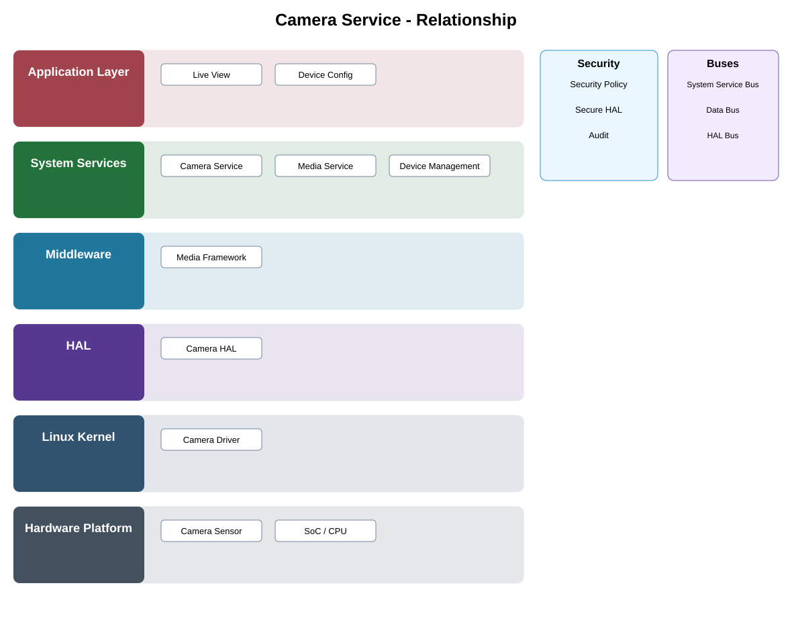

# Camera Service Detailed Design — Platform Baseline v2

## Status
Revised against PR #77.

## Deployment placement
**Camera product service**

## Purpose and ownership
Retain as shared product service over a platform-owned Capture Adapter contract, separating capture policy/session ownership from vendor control.

## Product-owned contract
CaptureSession contract with capability negotiation, ownership/arbitration, lifecycle, reconfiguration, cancellation, timeout/reset, and stable errors.

## Relationship overview

## Interaction/data planes
- **Control:** commands and lifecycle operations.
- **State/events:** operational state and durable product events.
- **Media/data:** bounded high-bandwidth buffers/streams where applicable.
- Provider transports are selected behind adapters.

## Review-driven decisions
- Competing clients are arbitrated by product policy.
- Session lifecycle and capability negotiation are explicit.
- Reconfiguration semantics are defined.
- Timeout/reset and cancellation are bounded.
- New vendor capture adapters preserve service semantics.

## Product Profile inputs
- placement and optional capabilities;
- compatible contract versions;
- adapter/backend selection;
- performance/resource/security budgets.

## Security
- authorization is enforced at protected service operations;
- standalone camera operation retains required local enforcement;
- protected models/recordings/credentials use approved security services.

## Open decisions
- exact provider technologies;
- numerical product-profile budgets;
- deployment-specific scaling and retry limits.

## Design acceptance criteria
1. Two competing capture requests receive deterministic policy outcomes.
2. Vendor adapter replacement preserves session contract behavior.
3. Timeout/reset maps to stable errors.
4. Requirement IDs use CAMERA_SERVICE prefix.

## Changelog
- 2026-10-04: Reworked for Platform Architecture Baseline v2 and review feedback.
