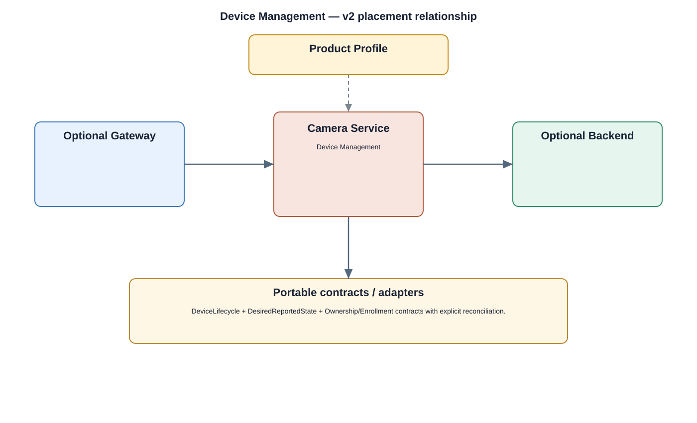

# Device Management Detailed Design

## Component
`device_management`

## Purpose
Coordinates device lifecycle, provisioning state, health, configuration, and management actions through stable system interfaces.

## Relationship overview

## Relevant system path

### Application Layer
- Device Config
- Settings
- Alarm
### System Services
- Device Management
- Network Service
- Storage Service
- Camera Service
### Middleware
- Database
- SSL / TLS
### HAL
- Network HAL
- Storage HAL
### Linux Kernel
- Network Driver
- Storage Driver
- Power Management
### Hardware Platform
- SoC / CPU
- Storage eMMC / SSD
- Ethernet / Wi-Fi
- Security Chip / TPM

## Security context
- Device Identity
- IAM / RBAC
- Security Policy
- Audit

## Communication boundaries
- System Service Bus
- Data Bus
- Middleware Bus

## Dependency rules
- Expose stable interfaces upward and keep implementation private.
- Keep vendor-specific behavior below the appropriate abstraction boundary.
- Do not depend on another component's private `src/`.

## Failure behavior
- device subsystem unavailable
- configuration conflict
- management action timeout

## Changelog
- 2026-10-03: Added detailed relationship design.
