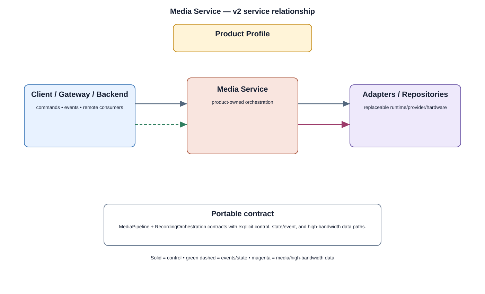

# Media Service Detailed Design — Platform Baseline v2

## Status
Revised against PR #77.

## Deployment placement
**Camera product service; optional equivalent modules may run on Gateway/Backend**

## Purpose and ownership
Own media/recording orchestration while keeping capture control, reusable media primitives, persistence, and transport providers behind separate contracts.

## Product-owned contract
MediaPipeline + RecordingOrchestration contracts with explicit control, state/event, and high-bandwidth data paths.

## Relationship overview

## Interaction/data planes
- **Control:** commands and lifecycle operations.
- **State/events:** operational state and durable product events.
- **Media/data:** bounded high-bandwidth buffers/streams where applicable.
- Provider transports are selected behind adapters.

## Review-driven decisions
- Camera Service owns capture sessions; Media Framework owns reusable buffer/timing primitives; Storage Service owns persistence contracts.
- Recording orchestration owns trigger/schedule, segment lifecycle, durable completion, metadata consistency, interrupted recording, and retention coordination.
- Control/state/media paths are separate.
- Deployment placement is explicit and does not change portable semantics.

## Product Profile inputs
- placement and optional capabilities;
- compatible contract versions;
- adapter/backend selection;
- performance/resource/security budgets.

## Security
- authorization is enforced at protected service operations;
- standalone camera operation retains required local enforcement;
- protected models/recordings/credentials use approved security services.

## Open decisions
- exact provider technologies;
- numerical product-profile budgets;
- deployment-specific scaling and retry limits.

## Design acceptance criteria
1. Recording completion is not acknowledged until selected repository durability criteria are satisfied.
2. Interrupted recording has a recoverable segment/metadata state.
3. Capture provider replacement does not change recording orchestration behavior.
4. Media buffers do not travel through a generic durable-event channel.

## Changelog
- 2026-10-04: Reworked for Platform Architecture Baseline v2 and review feedback.
