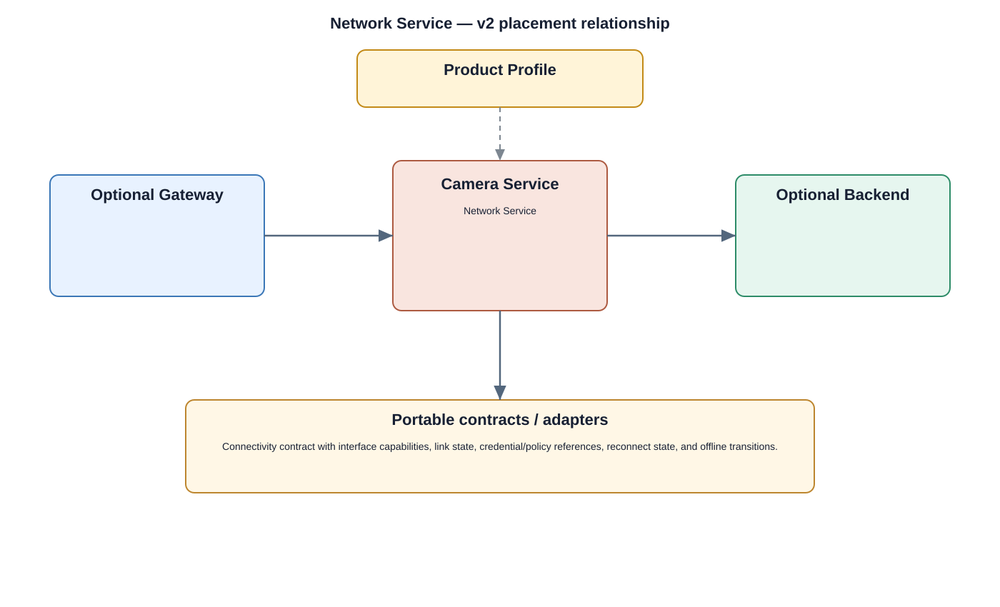

# Network Service Detailed Design — Platform Baseline v2

## Status
Revised against PR #77.

## Deployment placement
**Camera product service; Gateway/Backend have their own network/platform integration**

## Purpose and ownership
Own portable interface/link connectivity state and configuration while keeping cloud-provider integration and remote media protocols in separate adapters/services.

## Product-owned contract
Connectivity contract with interface capabilities, link state, credential/policy references, reconnect state, and offline transitions.

## Relationship overview

## Review-driven decisions
- Physical/interface configuration is separate from cloud-provider integration.
- Remote media protocol selection is not owned by Network Service.
- Connectivity states and reconnect bounds are explicit.
- Credential/policy ownership is externalized to security/profile contracts.
- Cloud integration uses a separate provider adapter.

## Product Profile inputs
- placement, repository/provider selections, and contract versions;
- offline behavior and recovery policy;
- durability/reconnect/reconciliation budgets;
- security profile.

## Security
- standalone camera keeps required local identity/authorization enforcement;
- provider credentials and keys are referenced through security services;
- management/storage/network changes are auditable.

## Decisions
- cloud and local implementations are peers behind product contracts, not different product semantics;
- platform/physical health is separated from domain persistence and orchestration.

## Open decisions
- exact repository/cloud providers;
- numerical durability, retry, and reconciliation budgets.

## Design acceptance criteria
1. Network Service works without any cloud provider.
2. Changing cloud provider does not alter interface/link semantics.
3. Offline/online transitions are deterministic.
4. Wi-Fi/Ethernet provider details do not escape the adapter boundary.

## Changelog
- 2026-10-04: Reworked for Platform Architecture Baseline v2 and review feedback.
