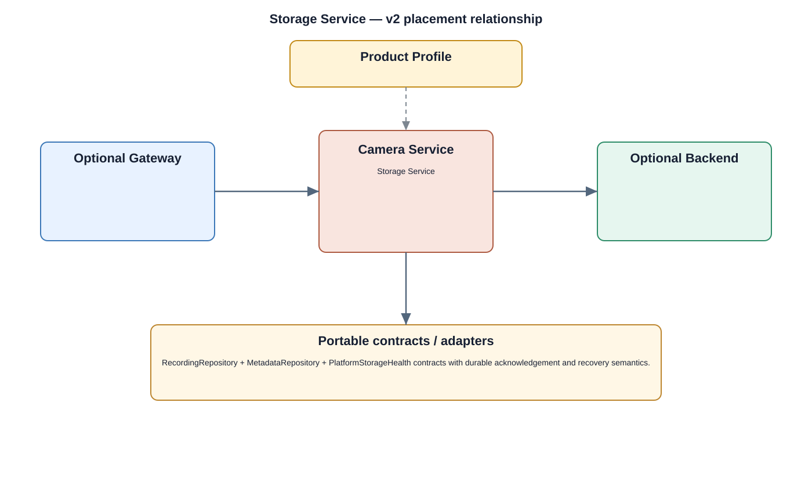

# Storage Service Detailed Design — Platform Baseline v2

## Status
Revised against PR #77.

## Deployment placement
**Camera product service; optional Gateway/Backend repository placements**

## Purpose and ownership
Separate recording-object persistence, metadata repositories, and platform storage health into distinct replacement boundaries.

## Product-owned contract
RecordingRepository + MetadataRepository + PlatformStorageHealth contracts with durable acknowledgement and recovery semantics.

## Relationship overview

## Review-driven decisions
- Recording objects, structured metadata, and physical/platform storage are separate concerns.
- Persistence acknowledgement states what durability has been achieved.
- Retention ownership and recovery responsibility are explicit.
- Power-loss consistency and encryption key references are defined.
- Local and cloud repositories preserve product semantics with explicit offline behavior.
- Backup/restore ownership is declared by Product Profile.

## Product Profile inputs
- placement, repository/provider selections, and contract versions;
- offline behavior and recovery policy;
- durability/reconnect/reconciliation budgets;
- security profile.

## Security
- standalone camera keeps required local identity/authorization enforcement;
- provider credentials and keys are referenced through security services;
- management/storage/network changes are auditable.

## Decisions
- cloud and local implementations are peers behind product contracts, not different product semantics;
- platform/physical health is separated from domain persistence and orchestration.

## Open decisions
- exact repository/cloud providers;
- numerical durability, retry, and reconciliation budgets.

## Design acceptance criteria
1. A cloud recording repository can replace local recording storage without changing recording identity semantics.
2. Database replacement does not alter metadata query semantics.
3. Platform storage failure maps to stable repository/service status.
4. Power loss leaves a defined recoverable recording/metadata state.

## Changelog
- 2026-10-04: Reworked for Platform Architecture Baseline v2 and review feedback.
