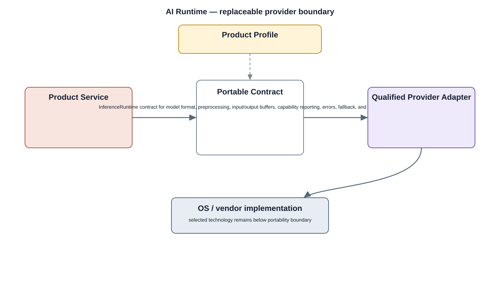

# AI Runtime Detailed Design

## Component
`ai_runtime`

## Purpose
Abstracts model execution and accelerator selection so upper services can run approved inference workloads independently of specific NPU vendors.

## Relationship overview

## Relevant system path

### System Services
- AI Inference Service
- Media Service
### Middleware
- AI Runtime
### HAL
- AI / NPU HAL
### Linux Kernel
- NPU Driver
### Hardware Platform
- NPU / AI Accelerator
- SoC / CPU

## Security context
- Model Integrity
- Security Policy
- Audit

## Communication boundaries
- Data Bus
- Middleware Bus
- HAL Bus

## Dependency rules
- Expose stable interfaces upward and keep implementation private.
- Keep vendor-specific behavior below the appropriate abstraction boundary.
- Do not depend on another component's private `src/`.

## Failure behavior
- model invalid
- runtime initialization failure
- accelerator unavailable

## Changelog
- 2026-10-03: Added detailed relationship design.
