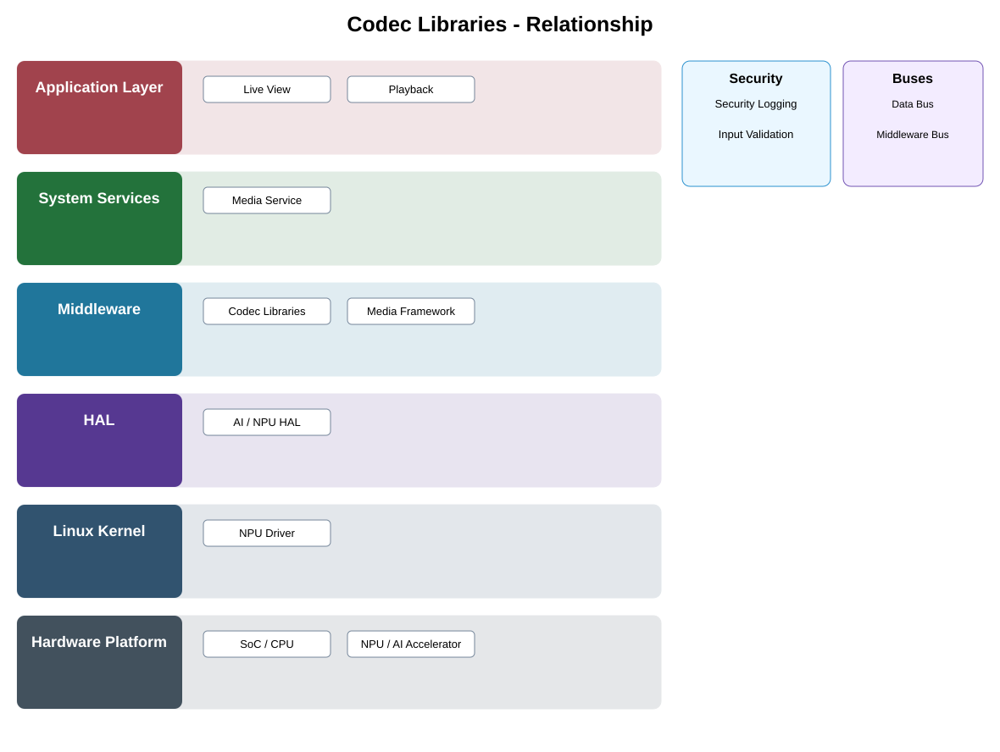

# Codec Libraries Detailed Design

## Component
`codec_libraries`

## Purpose
Provides reusable video and audio encode/decode capabilities for media pipelines without exposing codec implementation to applications.

## Relationship overview

## Relevant system path

### Application Layer
- Live View
- Playback
### System Services
- Media Service
### Middleware
- Codec Libraries
- Media Framework
### HAL
- AI / NPU HAL
### Linux Kernel
- NPU Driver
### Hardware Platform
- SoC / CPU
- NPU / AI Accelerator

## Security context
- Security Logging
- Input Validation

## Communication boundaries
- Data Bus
- Middleware Bus

## Dependency rules
- Keep the public contract stable and implementation private.
- Keep vendor-specific behavior behind the abstraction boundary.
- Do not depend on another component's private `src/`.

## Failure behavior
- unsupported codec
- malformed bitstream
- resource exhaustion

## Changelog
- 2026-10-03: Added detailed relationship design.
