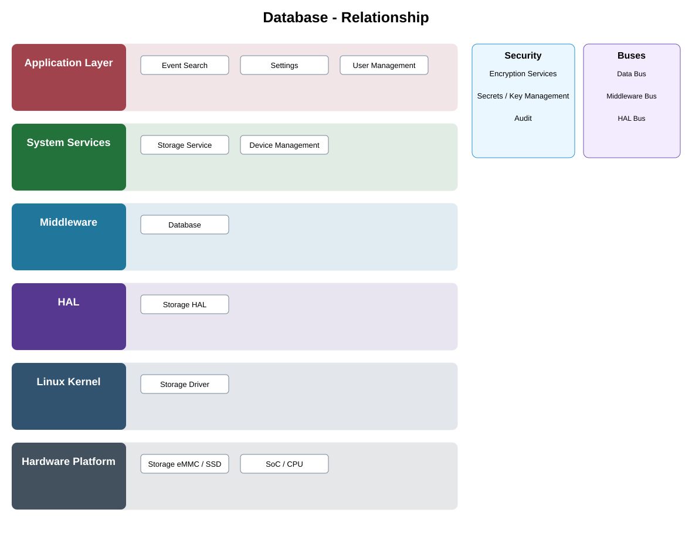

# Database Adapter Detailed Design — Platform Baseline v2

## Status
Revised against PR #77.

## Deployment placement
**Camera, Gateway, or Backend repository adapter selected by Product Profile**

## Purpose and ownership
Treat database engines as replaceable adapters beneath product-owned repositories rather than the owner of event/configuration/recording semantics.

## Portable contract
RepositoryPersistence adapter with query/transaction, schema/version migration, recovery, isolation, and backup/restore capabilities.

## Relationship overview

## Review-driven decisions
- Product repositories are separate from database engine.
- Local and backend deployments preserve repository semantics.
- Transaction requirements are explicit.
- Schema migration and rollback/recovery are defined.
- Access isolation and ownership relative to Storage Service are explicit.
- Replacement preserves behavior, not just method names.

## Product Profile inputs
- provider/backend selection;
- compatible contract version and capabilities;
- memory/latency/durability/resource budgets;
- fallback and recovery policy.

## Provider qualification
A replacement provider is acceptable only when it passes the design-level contract scenarios and preserves ownership, timing, error, and recovery semantics.

## Security
- protected data/models/credentials use approved security services;
- provider failures do not bypass policy;
- security-relevant failures are auditable.

## Open decisions
- exact provider technologies;
- numerical resource/performance limits;
- profile-specific qualification matrix.

## Design acceptance criteria
1. A database engine can be replaced without changing repository query semantics.
2. Migration failure leaves a defined recoverable state.
3. Local and backend adapters satisfy the same repository acceptance scenarios.
4. Requirement IDs use DATABASE prefix semantics.

## Changelog
- 2026-10-04: Reworked for Platform Architecture Baseline v2 and provider-replacement review feedback.
