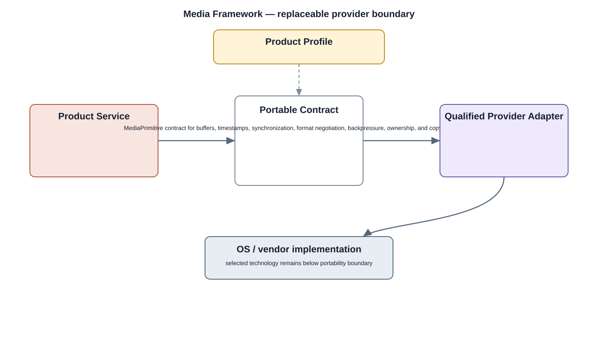

# Media Framework Detailed Design

## Component
`media_framework`

## Purpose
Provides reusable media pipeline, buffer, timing, capture, playback, encode, decode, and streaming primitives to system services.

## Relationship overview

## Relevant system path

### System Services
- Media Service
- Camera Service
- Storage Service
### Middleware
- Media Framework
- Codec Libraries
### HAL
- Camera HAL
- Display HAL
- Storage HAL
- Network HAL
### Linux Kernel
- Camera Driver
- Display Driver
- Storage Driver
- Network Driver
### Hardware Platform
- Camera Sensor
- Display
- Storage eMMC / SSD
- Ethernet / Wi-Fi
- SoC / CPU

## Security context
- Encryption
- Security Logging

## Communication boundaries
- Data Bus
- Middleware Bus
- HAL Bus

## Dependency rules
- Expose stable interfaces upward and keep implementation private.
- Keep vendor-specific behavior below the appropriate abstraction boundary.
- Do not depend on another component's private `src/`.

## Failure behavior
- buffer exhaustion
- codec failure
- source/sink unavailable

## Changelog
- 2026-10-03: Added detailed relationship design.
