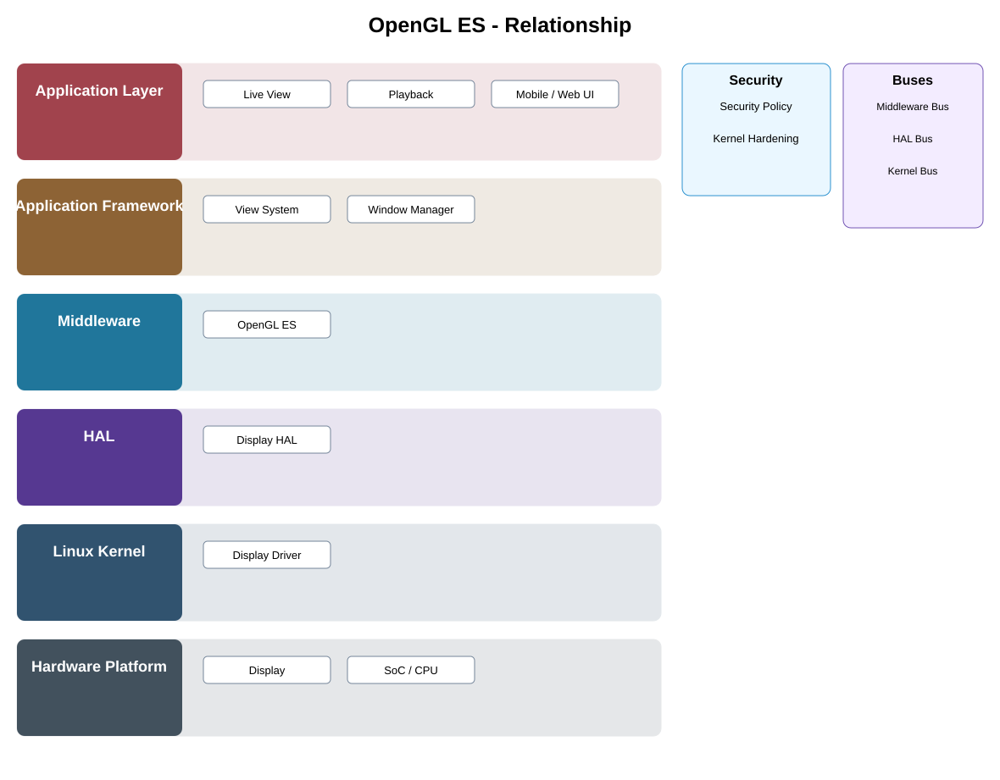

# OpenGL ES Detailed Design

## Component
`opengl_es`

## Purpose
Provides accelerated graphics rendering primitives for supported UI and media presentation paths while hiding low-level display implementation from upper layers.

## Relationship overview

## Relevant system path

### Application Layer
- Live View
- Playback
- Mobile / Web UI
### Application Framework
- View System
- Window Manager
### Middleware
- OpenGL ES
### HAL
- Display HAL
### Linux Kernel
- Display Driver
### Hardware Platform
- Display
- SoC / CPU

## Security context
- Security Policy
- Kernel Hardening

## Communication boundaries
- Middleware Bus
- HAL Bus
- Kernel Bus

## Dependency rules
- Expose stable interfaces upward and keep implementation private.
- Keep vendor-specific behavior below the appropriate abstraction boundary.
- Do not depend on another component's private `src/`.

## Failure behavior
- graphics context loss
- resource allocation failure
- display unavailable

## Changelog
- 2026-10-03: Added detailed relationship design.
