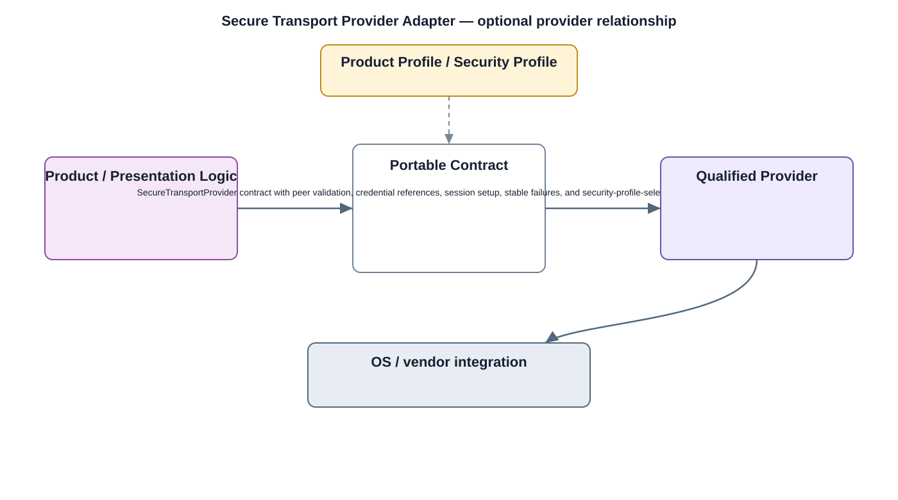

# Secure Transport Provider Adapter Detailed Design — Platform Baseline v2

## Status
Revised against PR #77.

## Deployment placement
**Camera/Client/Gateway/Backend provider adapter as required by transport-security policy**

## Purpose and ownership
Re-scope the middleware component as a replaceable secure-transport library/provider adapter; transport-security policy is owned by the TLS/mTLS security service.

## Portable contract
SecureTransportProvider contract with peer validation, credential references, session setup, stable failures, and security-profile-selected protocol capabilities.

## Relationship overview

## Review-driven decisions
- Transport policy is owned by security_services/tls_mtls.
- No independent duplicate handshake/security policy exists here.
- Legacy SSL is not implied as an approved protocol.
- Credentials are referenced, not owned by the provider.
- Protocol/cipher selections come from security profiles.

## Product Profile inputs
- enable/omit decision;
- deployment placement;
- provider/backend and compatible version;
- security/capability profile;
- resource limits.

## Provider qualification
Providers are qualified against the portable contract; provider-specific API types remain below the adapter.

## Security
- mandatory security outcomes are defined outside optional convenience APIs;
- insecure fallback is not permitted where protection is required;
- provider failures are auditable.

## Open decisions
- exact provider/API selection per profile;
- numerical resource and performance constraints.

## Design acceptance criteria
1. A TLS library can be replaced without changing transport-security policy.
2. Invalid peer identity fails according to security policy.
3. Provider never silently falls back to insecure transport.
4. Credential rotation does not require changes to product callers.

## Changelog
- 2026-10-04: Re-scoped for Platform Architecture Baseline v2 and review feedback.
