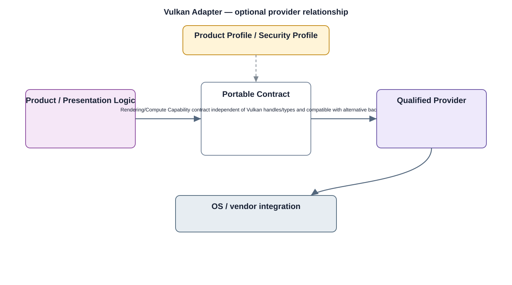

# Vulkan Adapter Detailed Design — Platform Baseline v2

## Status
Revised against PR #77.

## Deployment placement
**Optional client, camera-local display, or compute adapter selected by Product Profile**

## Purpose and ownership
Classify Vulkan as an optional rendering/compute adapter beneath portable capability contracts rather than a shared product dependency.

## Portable contract
Rendering/Compute Capability contract independent of Vulkan handles/types and compatible with alternative backends.

## Relationship overview

## Review-driven decisions
- Ownership relative to View System/Presentation State is explicit.
- OpenGL ES and Vulkan are alternative/provider choices, not mandatory parallel dependencies.
- Deployment using Vulkan is profile-selected.
- Unsupported features have stable behavior.
- Shared product code never depends directly on Vulkan API types.

## Product Profile inputs
- enable/omit decision;
- deployment placement;
- provider/backend and compatible version;
- security/capability profile;
- resource limits.

## Provider qualification
Providers are qualified against the portable contract; provider-specific API types remain below the adapter.

## Security
- mandatory security outcomes are defined outside optional convenience APIs;
- insecure fallback is not permitted where protection is required;
- provider failures are auditable.

## Open decisions
- exact provider/API selection per profile;
- numerical resource and performance constraints.

## Design acceptance criteria
1. Product logic runs with Vulkan absent.
2. Rendering backend can switch between Vulkan and another qualified backend.
3. Unsupported extension/capability is reported before use.
4. Client and camera-local graphics remain separately qualified.

## Changelog
- 2026-10-04: Re-scoped for Platform Architecture Baseline v2 and review feedback.
