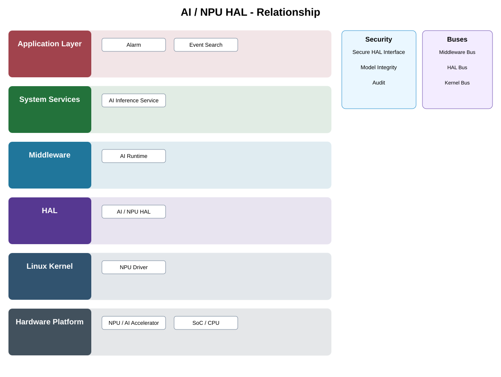

# AI / NPU HAL Detailed Design

## Component
`ai_npu_hal`

## Purpose
Abstracts AI accelerator capabilities and vendor-specific NPU interfaces behind a stable execution boundary.

## Relationship overview

## Relevant system path

### Application Layer
- Alarm
- Event Search
### System Services
- AI Inference Service
### Middleware
- AI Runtime
### HAL
- AI / NPU HAL
### Linux Kernel
- NPU Driver
### Hardware Platform
- NPU / AI Accelerator
- SoC / CPU

## Security context
- Secure HAL Interface
- Model Integrity
- Audit

## Communication boundaries
- Middleware Bus
- HAL Bus
- Kernel Bus

## Dependency rules
- Keep the public contract stable and implementation private.
- Keep vendor-specific behavior behind the abstraction boundary.
- Do not depend on another component's private `src/`.

## Failure behavior
- accelerator unavailable
- unsupported graph
- driver timeout

## Changelog
- 2026-10-03: Added detailed relationship design.
