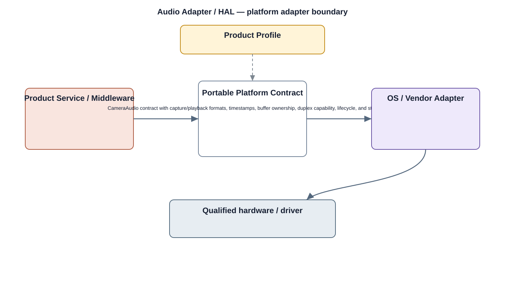

# Audio Adapter / HAL Detailed Design — Platform Baseline v2

## Status
Revised against PR #77.

## Deployment placement
**Optional Camera platform adapter; client audio is separate**

## Purpose and ownership
Treat camera-side audio as an explicitly selected product capability and isolate OS/vendor audio implementation behind a portable camera-audio contract.

## Portable contract
CameraAudio contract with capture/playback formats, timestamps, buffer ownership, duplex capability, lifecycle, and stable errors.

## Relationship overview

## Review-driven decisions
- Camera audio and client playback audio are separate deployments.
- Audio capability is optional by Product Profile.
- Formats/timing/buffer ownership are explicit.
- Duplex behavior and lifecycle are declared.
- OS/vendor details remain behind adapters.

## Product Profile inputs
- capability present/absent;
- selected provider and compatible version;
- performance/resource/power constraints;
- recovery and security profile.

## Supplier qualification
Provider replacement is qualified against ownership, lifecycle, timing/durability, reset/error, and capability scenarios.

## Security
- raw device/provider controls are not exposed to applications;
- access is mediated by owning platform/service boundaries;
- security-relevant failures are auditable.

## Open decisions
- selected OS/vendor provider;
- numerical capability and recovery constraints.

## Design acceptance criteria
1. A no-audio camera profile omits this adapter.
2. Changing camera audio supplier does not change upper media contracts.
3. Buffer overrun/underrun maps to stable status.
4. Client audio implementation is not constrained by camera Audio HAL.

## Changelog
- 2026-10-04: Reworked for Platform Architecture Baseline v2 and supplier-replacement review feedback.
