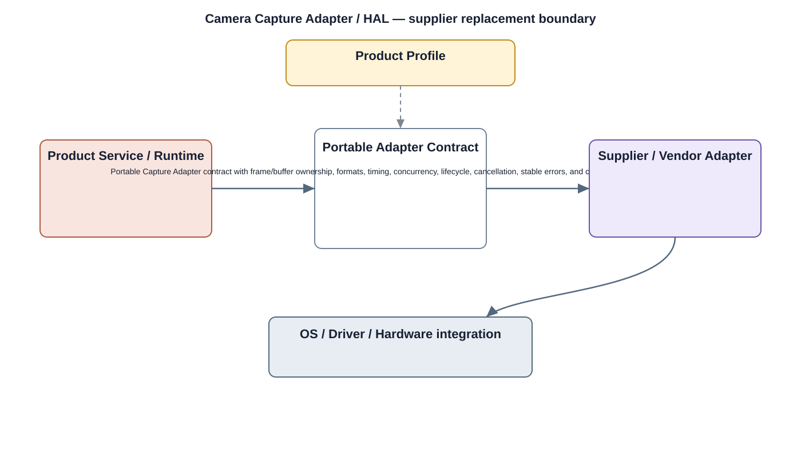

# Camera HAL Detailed Design

## Component
`camera_hal`

## Purpose
Abstracts camera sensor and image-pipeline vendor details behind a stable product-owned interface.

## Relationship overview

## Relevant system path

### Application Layer
- Live View
- Device Config
### System Services
- Camera Service
- Media Service
### Middleware
- Media Framework
### HAL
- Camera HAL
### Linux Kernel
- Camera Driver
### Hardware Platform
- Camera Sensor
- SoC / CPU

## Security context
- Secure HAL Interface
- Device Identity
- Audit

## Communication boundaries
- Middleware Bus
- HAL Bus
- Kernel Bus

## Dependency rules
- Keep the public contract stable and implementation private.
- Keep vendor-specific behavior behind the abstraction boundary.
- Do not depend on another component's private `src/`.

## Failure behavior
- sensor absent
- unsupported mode
- driver error

## Changelog
- 2026-10-03: Added detailed relationship design.
