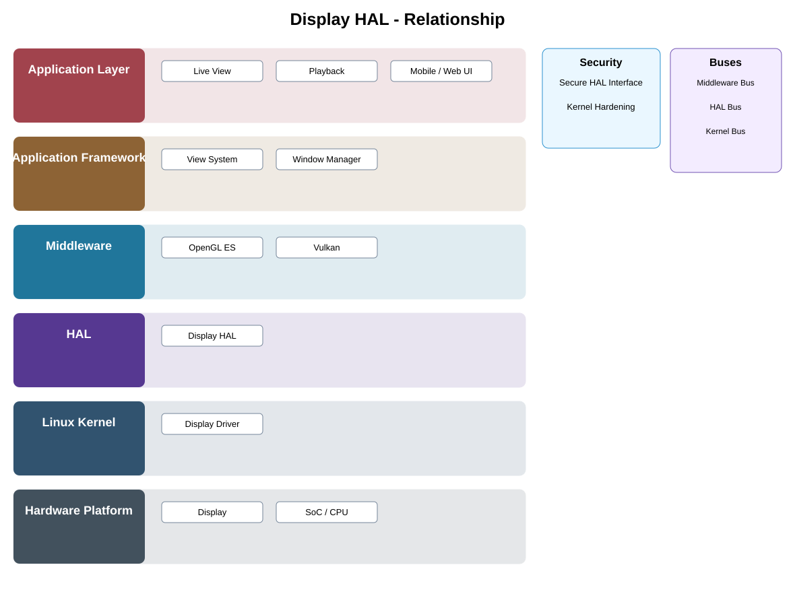

# Local Display Adapter / HAL Detailed Design — Platform Baseline v2

## Status
Revised against PR #77.

## Deployment placement
**Optional Camera-local display adapter only**

## Purpose and ownership
Make display support optional and explicitly separate camera-local display from Android/iOS/Web client presentation.

## Portable contract
LocalDisplay contract with capability/mode negotiation, surface/buffer ownership, presentation lifecycle, reset, and stable errors.

## Relationship overview

## Review-driven decisions
- Headless camera profiles omit the component.
- Client screens are outside this HAL.
- Graphics API/driver selection is a platform adapter choice.
- Surface/buffer ownership is explicit.
- Display reset/failure behavior is defined.

## Product Profile inputs
- capability present/absent;
- selected provider and compatible version;
- performance/resource/power constraints;
- recovery and security profile.

## Supplier qualification
Provider replacement is qualified against ownership, lifecycle, timing/durability, reset/error, and capability scenarios.

## Security
- raw device/provider controls are not exposed to applications;
- access is mediated by owning platform/service boundaries;
- security-relevant failures are auditable.

## Open decisions
- selected OS/vendor provider;
- numerical capability and recovery constraints.

## Design acceptance criteria
1. Headless camera has no display dependency.
2. Changing local graphics/display backend does not alter camera product services.
3. Client presentation remains independent of camera Display HAL.
4. Surface/buffer lifecycle has no ambiguous ownership.

## Changelog
- 2026-10-04: Reworked for Platform Architecture Baseline v2 and supplier-replacement review feedback.
