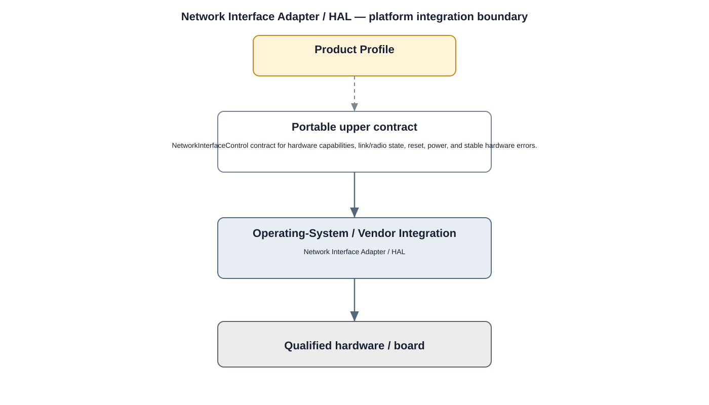

# Network HAL Detailed Design

## Component
`network_hal`

## Purpose
Abstracts network hardware and vendor-specific network controls behind stable product interfaces.

## Relationship overview

## Relevant system path

### Application Layer
- Live View
- Playback
- Device Config
### System Services
- Network Service
- Device Management
### Middleware
- SSL / TLS
### HAL
- Network HAL
### Linux Kernel
- Network Driver
- Wi-Fi / BT Driver
### Hardware Platform
- Ethernet / Wi-Fi
- SoC / CPU

## Security context
- Secure HAL Interface
- Device Identity
- Audit

## Communication boundaries
- Middleware Bus
- HAL Bus
- Kernel Bus

## Dependency rules
- Preserve the stable HAL/driver boundary.
- Keep vendor-specific behavior private to the owning lower layer.
- Do not expose direct hardware access to upper layers.

## Failure behavior
- link unavailable
- unsupported configuration
- driver failure

## Changelog
- 2026-10-03: Added detailed relationship design.
