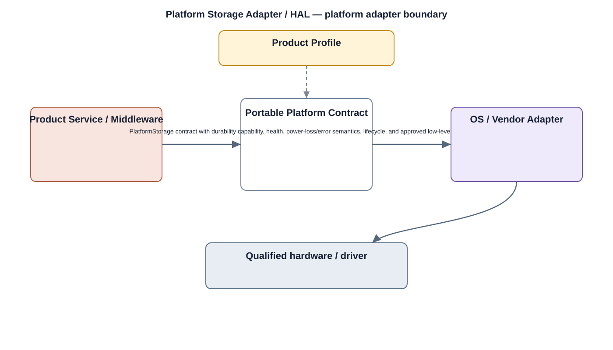

# Storage HAL Detailed Design

## Component
`storage_hal`

## Purpose
Abstracts physical storage devices and vendor-specific storage behavior behind a stable storage interface.

## Relationship overview

## Relevant system path

### Application Layer
- Playback
- Event Search
- Settings
### System Services
- Storage Service
- Device Management
### Middleware
- Database
- Media Framework
### HAL
- Storage HAL
### Linux Kernel
- Storage Driver
### Hardware Platform
- Storage eMMC / SSD
- SoC / CPU

## Security context
- Secure HAL Interface
- Encryption
- Audit

## Communication boundaries
- Middleware Bus
- HAL Bus
- Kernel Bus

## Dependency rules
- Preserve the stable HAL/driver boundary.
- Keep vendor-specific behavior private to the owning lower layer.
- Do not expose direct hardware access to upper layers.

## Failure behavior
- device unavailable
- media error
- capacity exhausted

## Changelog
- 2026-10-03: Added detailed relationship design.
