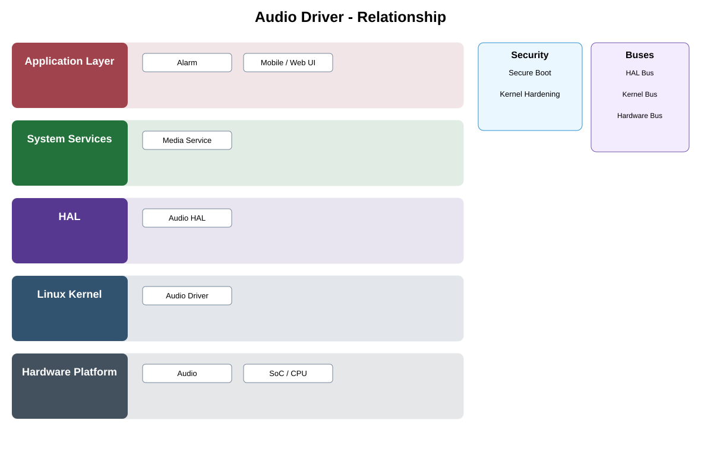

# Audio Driver Detailed Design

## Component
`audio_driver`

## Purpose
Provides kernel support for audio capture and playback hardware consumed by the Audio HAL.

## Relationship overview

## Relevant system path

### Application Layer
- Alarm
- Mobile / Web UI
### System Services
- Media Service
### HAL
- Audio HAL
### Linux Kernel
- Audio Driver
### Hardware Platform
- Audio
- SoC / CPU

## Security context
- Secure Boot
- Kernel Hardening

## Communication boundaries
- HAL Bus
- Kernel Bus
- Hardware Bus

## Dependency rules
- Expose only approved kernel interfaces upward.
- Keep hardware-specific behavior private to the driver or power subsystem.
- Upper layers shall not bypass HAL/service ownership.

## Failure behavior
- device unavailable
- buffer underrun or overrun
- driver reset

## Changelog
- 2026-10-03: Added detailed relationship design.
