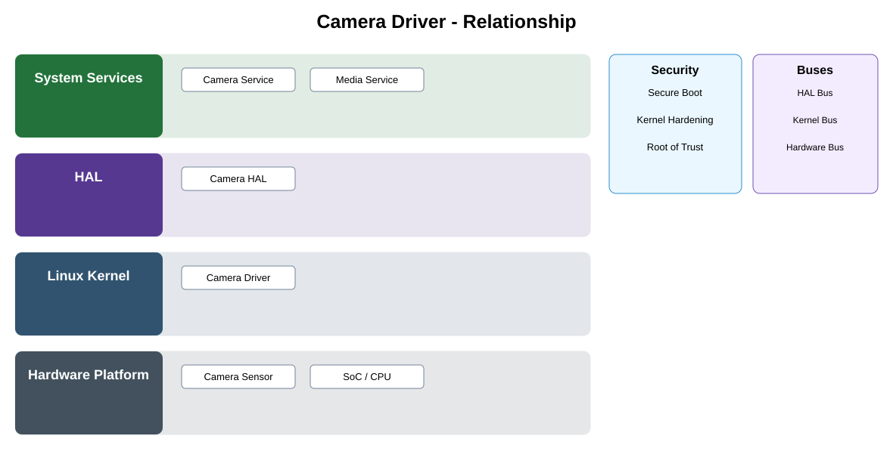

# Camera Driver / Platform Integration Detailed Design — Platform Baseline v2

## Status
Revised against PR #77.

## Deployment placement
**Operating-System / Vendor Integration for selected Camera platform**

## Purpose and ownership
Scope as platform integration beneath the portable Capture Adapter; reuse supplier/upstream drivers where suitable rather than making driver code part of the portable product contract.

## Integration contract
Driver integration guarantees for supported sensor/board modes, calibration ownership, frame transfer, timing, reset, and stable error mapping.

## Relationship overview

## Review-driven decisions
- Portable capture contract remains above the driver.
- Sensor/board qualification is explicit.
- Calibration/image tuning ownership is declared.
- Frame/buffer transfer and timing are defined.
- Driver/reset errors map to portable status.
- Linux is an example selected OS, not universal product architecture.

## Product Profile inputs
- selected OS/vendor/board target;
- capability requirement or optionality;
- compatible driver/firmware version;
- reset, resource, security, and performance constraints.

## Qualification
Platform integration is qualified against the portable contract above it. Supplier/upstream drivers are preferred where they satisfy the required guarantees.

## Security
- privileged/raw device access remains below OS/platform isolation;
- required firmware/driver authenticity follows security profile;
- security-relevant faults are auditable.

## Open decisions
- concrete OS/vendor driver selections;
- board-specific numerical timing/resource limits.

## Design acceptance criteria
1. Supplier/upstream driver can be used without changing Camera Service.
2. Board/sensor qualification proves all required capture modes.
3. Reset recovers according to defined platform behavior.
4. Driver-specific handles never escape the platform adapter boundary.

## Changelog
- 2026-10-04: Re-scoped as OS/vendor integration for Platform Architecture Baseline v2.
