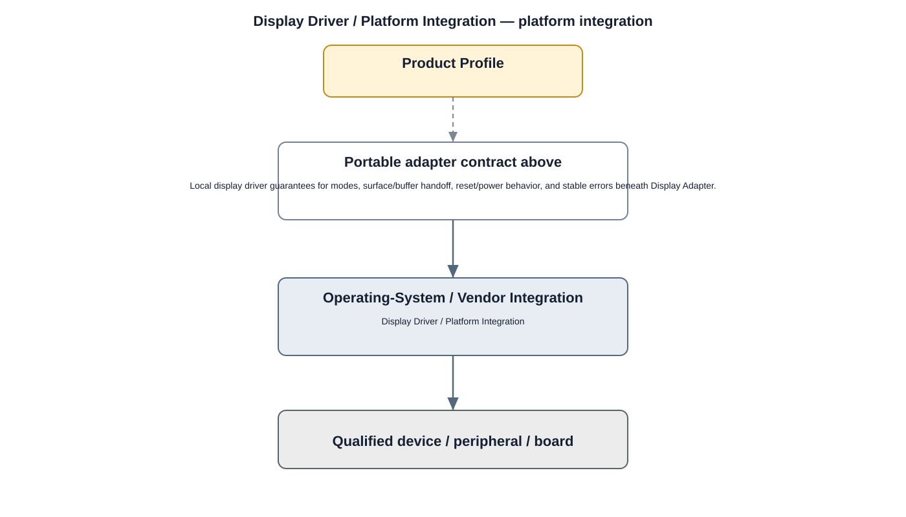

# Display Driver Detailed Design

## Component
`display_driver`

## Purpose
Controls display hardware and exposes kernel rendering/display interfaces to the Display HAL.

## Relationship overview

## Relevant system path

### Application Framework
- Window Manager
- View System
### Middleware
- OpenGL ES
- Vulkan
### HAL
- Display HAL
### Linux Kernel
- Display Driver
### Hardware Platform
- Display
- SoC / CPU

## Security context
- Secure Boot
- Kernel Hardening

## Communication boundaries
- HAL Bus
- Kernel Bus
- Hardware Bus

## Dependency rules
- Expose only approved kernel interfaces upward.
- Keep hardware-specific implementation private to the driver.
- Do not allow user/application layers to bypass HAL/service ownership.

## Failure behavior
- display probe failure
- mode set failure
- buffer submission failure

## Changelog
- 2026-10-03: Added detailed relationship design.
