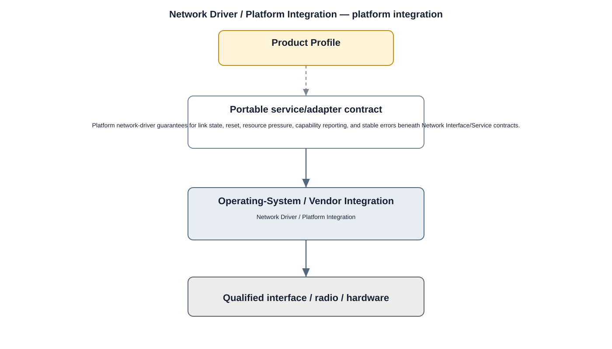

# Network Driver Detailed Design

## Component
`network_driver`

## Purpose
Provides kernel support for Ethernet and other supported network interfaces consumed by the Network HAL.

## Relationship overview

## Relevant system path

### Application Layer
- Live View
- Playback
### System Services
- Network Service
### HAL
- Network HAL
### Linux Kernel
- Network Driver
### Hardware Platform
- Ethernet / Wi-Fi
- SoC / CPU

## Security context
- Kernel Hardening
- Device Identity
- Audit

## Communication boundaries
- HAL Bus
- Kernel Bus
- Hardware Bus

## Dependency rules
- Expose only approved kernel interfaces upward.
- Keep hardware-specific implementation private to the driver.
- Do not allow user/application layers to bypass HAL/service ownership.

## Failure behavior
- link down
- driver reset
- packet-ring/resource exhaustion

## Changelog
- 2026-10-03: Added detailed relationship design.
