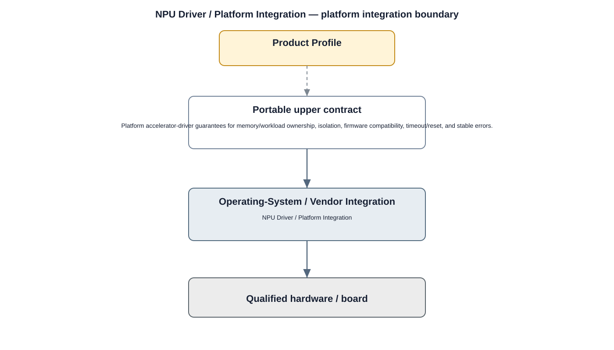

# NPU Driver / Platform Integration Detailed Design — Platform Baseline v2

## Status
Revised against PR #77.

## Deployment placement
**Optional Operating-System / Vendor Integration selected by Product Profile**

## Purpose and ownership
Scope as an optional accelerator driver adapter beneath the portable inference-acceleration contract.

## Integration contract
Platform accelerator-driver guarantees for memory/workload ownership, isolation, firmware compatibility, timeout/reset, and stable errors.

## Relationship overview

## Review-driven decisions
- NPU is optional unless Product Profile requires it.
- Kernel/vendor interfaces stay below portability boundary.
- Workload/memory ownership and isolation are explicit.
- Firmware compatibility is qualified.
- Timeout/reset behavior is bounded.
- Qualification targets the upper Inference Acceleration contract.

## Product Profile inputs
- selected OS/vendor/board target;
- capability requirement or optionality;
- compatible driver/firmware version;
- reset, resource, security, and performance constraints.

## Qualification
Platform integration is qualified against the portable contract above it. Supplier/upstream drivers are preferred where they satisfy the required guarantees.

## Security
- privileged/raw device access remains below OS/platform isolation;
- required firmware/driver authenticity follows security profile;
- security-relevant faults are auditable.

## Open decisions
- concrete OS/vendor driver selections;
- board-specific numerical timing/resource limits.

## Design acceptance criteria
1. Product runs without NPU driver when fallback profile permits.
2. Changing NPU driver/vendor preserves the upper acceleration contract.
3. Firmware incompatibility is detected before workload execution.
4. Requirement IDs are globally unique using NPU_DRIVER prefix.

## Changelog
- 2026-10-04: Re-scoped as OS/vendor integration for Platform Architecture Baseline v2.
