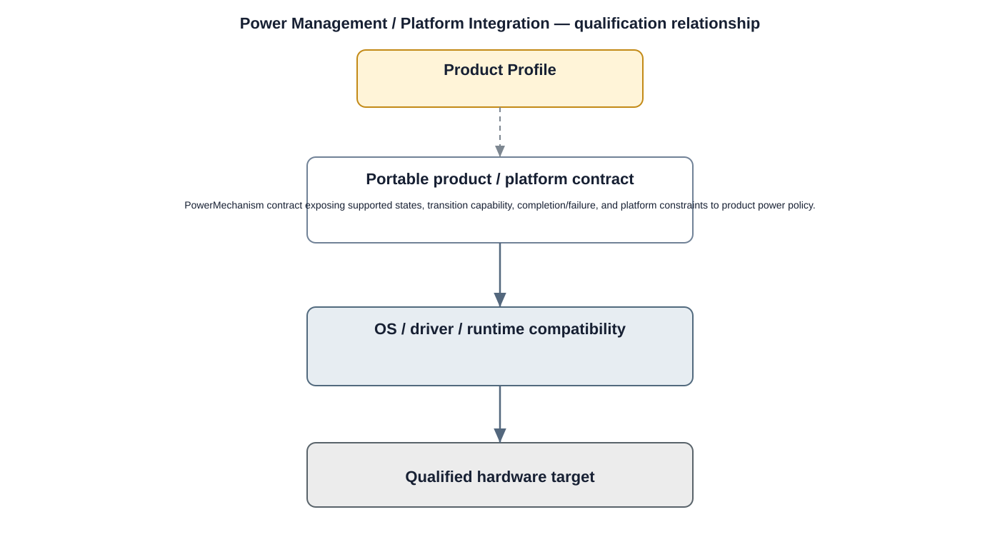

# Power Management / Platform Integration Detailed Design — Platform Baseline v2

## Status
Revised against PR #77.

## Deployment placement
**Camera OS/board integration with product power policy above it**

## Purpose and ownership
Separate product power policy from the operating-system/board mechanisms that execute suspend, resume, clock, thermal, and device power transitions.

## Qualification contract
PowerMechanism contract exposing supported states, transition capability, completion/failure, and platform constraints to product power policy.

## Relationship overview

## Review-driven decisions
- Active recording and pending writes constrain transitions.
- Network sessions and key/security state are considered.
- Suspend/resume safe states are explicit.
- Thermal limits and degraded states are explicit.
- Product policy remains independent of OS-specific controls.

## Product Profile inputs
- hardware capability required/optional;
- operating envelope and resource budgets;
- compatible OS/driver/runtime/toolchain;
- security and fallback policy.

## Qualification model
Hardware is selected by measurable capability and compatibility criteria. Supplier replacement is permitted after qualification while preserving upper product contracts.

## Security
- hardware trust/isolation capabilities are declared, not assumed;
- mandatory protection requirements come from the security profile;
- security-relevant hardware faults are auditable.

## Open decisions
- concrete supplier targets;
- numerical compute/thermal/power/resource thresholds.

## Design acceptance criteria
1. Power transition is blocked/deferred when recording durability requirements are not met.
2. Resume restores required service state deterministically.
3. Thermal constraint maps to profile-defined degradation.
4. Requirement IDs use globally unique POWER_MANAGEMENT prefix.

## Changelog
- 2026-10-04: Reworked as Product Profile / hardware qualification design for Platform Architecture Baseline v2.
