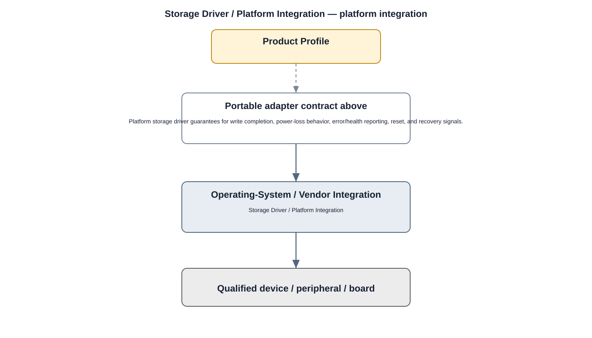

# Storage Driver Detailed Design

## Component
`storage_driver`

## Purpose
Provides kernel access to supported persistent-storage hardware for the Storage HAL and filesystem layers.

## Relationship overview

## Relevant system path

### System Services
- Storage Service
### Middleware
- Database
- Media Framework
### HAL
- Storage HAL
### Linux Kernel
- Storage Driver
### Hardware Platform
- Storage eMMC / SSD
- SoC / CPU

## Security context
- Secure Boot
- Kernel Hardening
- Encryption

## Communication boundaries
- HAL Bus
- Kernel Bus
- Hardware Bus

## Dependency rules
- Expose only approved kernel interfaces upward.
- Keep hardware-specific implementation private to the driver.
- Do not allow user/application layers to bypass HAL/service ownership.

## Failure behavior
- device probe failure
- I/O error
- media timeout

## Changelog
- 2026-10-03: Added detailed relationship design.
