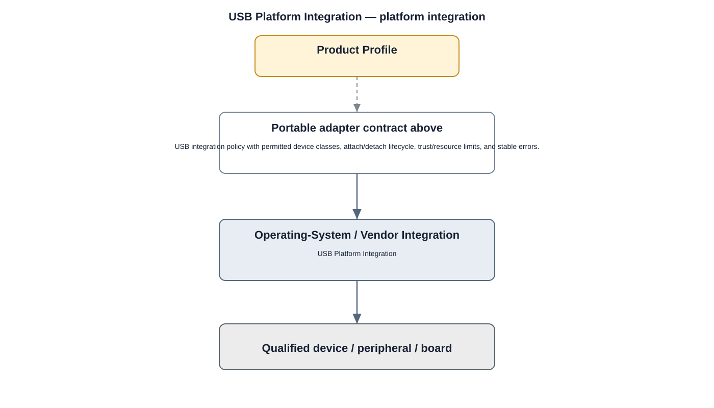

# USB Driver Detailed Design

## Component
`usb_driver`

## Purpose
Provides kernel support for supported USB controllers and USB-connected peripherals without exposing controller details to upper layers.

## Relationship overview

## Relevant system path

### System Services
- Device Management
### HAL
- Device-specific HALs
### Linux Kernel
- USB Driver
### Hardware Platform
- Other Peripherals
- SoC / CPU

## Security context
- Kernel Hardening
- Security Policy
- Audit

## Communication boundaries
- Kernel Bus
- Hardware Bus

## Dependency rules
- Expose only approved kernel interfaces upward.
- Keep hardware-specific implementation private to the driver.
- Do not allow user/application layers to bypass HAL/service ownership.

## Failure behavior
- enumeration failure
- device disconnect
- transfer timeout

## Changelog
- 2026-10-03: Added detailed relationship design.
