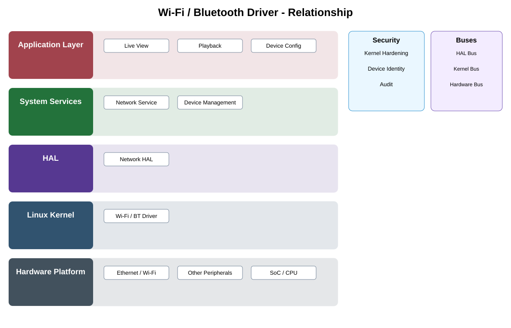

# Wi-Fi / Bluetooth Driver Detailed Design

## Component
`wifi_bt_driver`

## Purpose
Provides kernel support for supported Wi-Fi and Bluetooth hardware while isolating radio-specific behavior from upper network services.

## Relationship overview

## Relevant system path

### Application Layer
- Live View
- Playback
- Device Config
### System Services
- Network Service
- Device Management
### HAL
- Network HAL
### Linux Kernel
- Wi-Fi / BT Driver
### Hardware Platform
- Ethernet / Wi-Fi
- Other Peripherals
- SoC / CPU

## Security context
- Kernel Hardening
- Device Identity
- Audit

## Communication boundaries
- HAL Bus
- Kernel Bus
- Hardware Bus

## Dependency rules
- Expose only approved kernel interfaces upward.
- Keep hardware-specific behavior private to the driver or power subsystem.
- Upper layers shall not bypass HAL/service ownership.

## Failure behavior
- radio unavailable
- firmware load failure
- association loss

## Changelog
- 2026-10-03: Added detailed relationship design.
