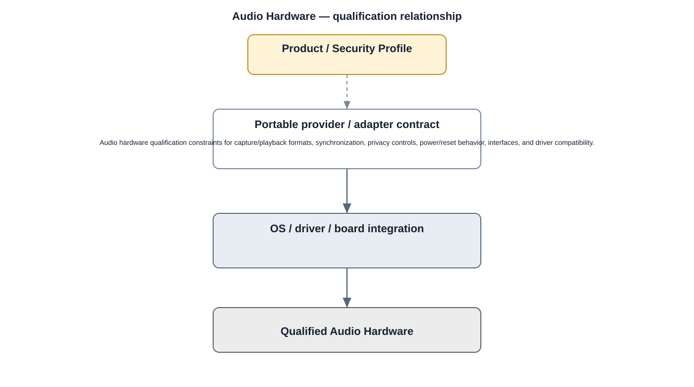

# Audio Hardware Detailed Design — Platform Baseline v2

## Status
Revised against PR #77.

## Deployment placement
**Optional qualified camera audio hardware target**

## Purpose and ownership
Treat microphones, speakers, and audio codecs as independently declared Product Profile capabilities.

## Qualification contract
Audio hardware qualification constraints for capture/playback formats, synchronization, privacy controls, power/reset behavior, interfaces, and driver compatibility.

## Relationship overview

## Review-driven decisions
- Microphone, speaker, and codec capabilities can be selected independently.
- Formats and synchronization capabilities are measurable.
- Privacy/mute indicators or controls are profile/security requirements where applicable.
- Power/reset behavior is explicit.
- Supplier replacement preserves upper CameraAudio contract.

## Product / Security Profile inputs
- required and optional capabilities;
- supplier/provider selection;
- compatible board/driver/firmware versions;
- measurable power/performance/security constraints.

## Qualification model
Supplier/provider replacement is permitted only when the selected implementation satisfies the same portable upper contracts and profile obligations.

## Security
- security outcomes are defined by the security profile, not by vendor marketing categories;
- hardware details remain below provider contracts;
- relevant faults and lifecycle events are auditable.

## Open decisions
- concrete supplier/provider selection;
- profile-specific measurable thresholds and evidence.

## Design acceptance criteria
1. A video-only profile omits all camera audio hardware.
2. Microphone-only profile does not require speaker capability.
3. Audio supplier replacement preserves declared formats/timing after qualification.
4. Privacy-control capability required by profile is verified.

## Changelog
- 2026-10-04: Reworked as hardware/provider qualification design for Platform Architecture Baseline v2.
