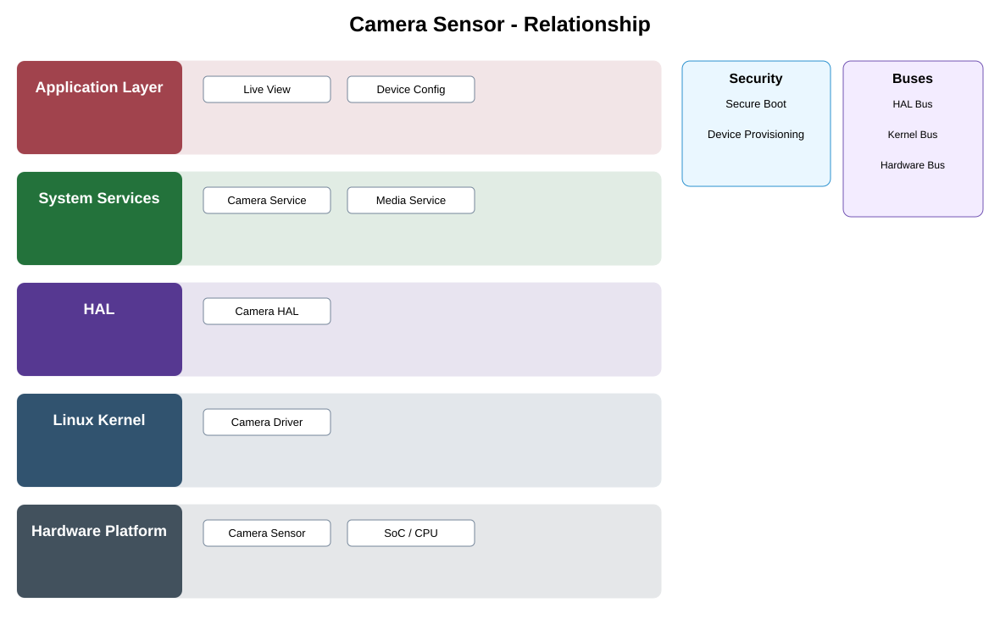

# Camera Sensor Detailed Design

## Component
`camera_sensor`

## Purpose
Converts incoming light into digital image data and supplies the physical image source for capture and analytics pipelines.

## Relationship overview

## Relevant system path

### Application Layer
- Live View
- Device Config
### System Services
- Camera Service
- Media Service
### HAL
- Camera HAL
### Linux Kernel
- Camera Driver
### Hardware Platform
- Camera Sensor
- SoC / CPU

## Security context
- Secure Boot
- Device Provisioning

## Communication boundaries
- HAL Bus
- Kernel Bus
- Hardware Bus

## Dependency rules
- Hardware is consumed only through approved kernel/HAL/service abstractions.
- Platform-specific behavior shall not leak into upper-layer application APIs.
- Security and lifecycle controls remain active across reset and power transitions.

## Failure behavior
- sensor not detected
- invalid mode
- streaming fault

## Changelog
- 2026-10-03: Added detailed relationship design.
