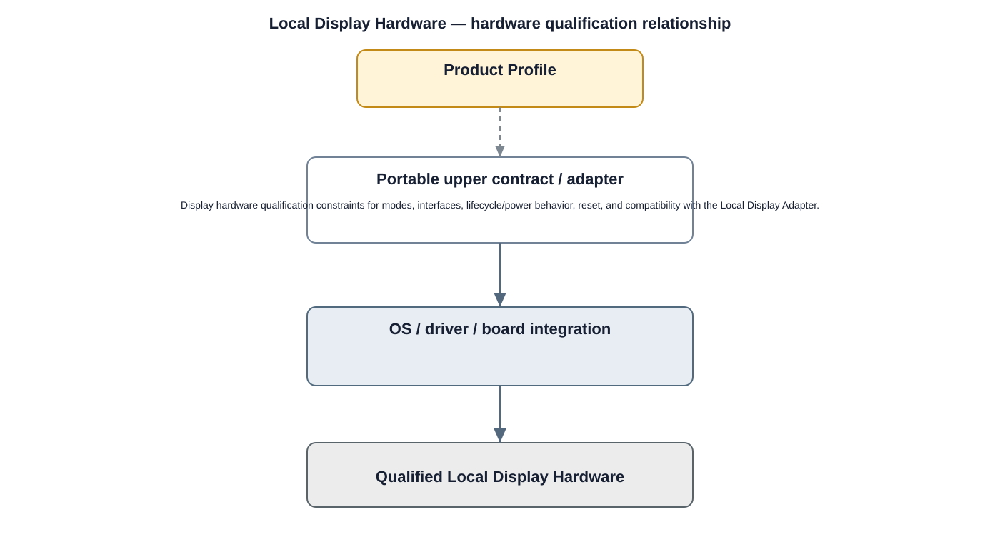

# Display Detailed Design

## Component
`display`

## Purpose
Provides local visual output for product variants that include an integrated or attached display.

## Relationship overview

## Relevant system path

### Application Layer
- Live View
- Playback
- Mobile / Web UI
### Application Framework
- View System
- Window Manager
### Middleware
- OpenGL ES
- Vulkan
### HAL
- Display HAL
### Linux Kernel
- Display Driver
### Hardware Platform
- Display
- SoC / CPU

## Security context
- Secure Boot
- Kernel Hardening

## Communication boundaries
- HAL Bus
- Kernel Bus
- Hardware Bus

## Dependency rules
- Hardware is consumed only through approved kernel/HAL/service abstractions.
- Platform-specific behavior shall not leak into upper-layer application APIs.
- Security and lifecycle controls remain active across reset and power transitions.

## Failure behavior
- display absent
- mode unsupported
- link or panel failure

## Changelog
- 2026-10-03: Added detailed relationship design.
