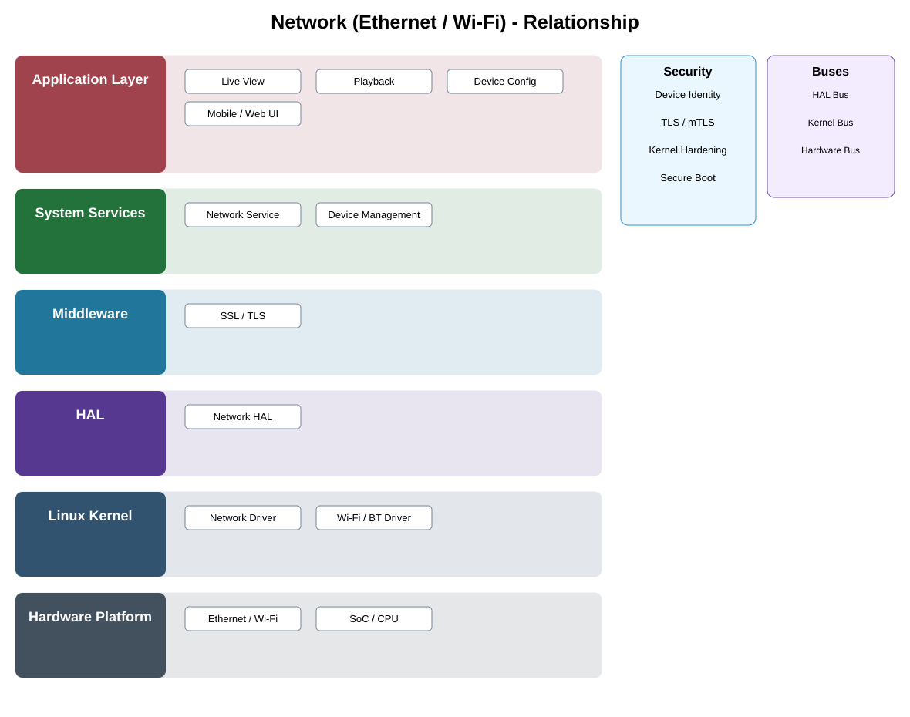

# Network Hardware (Ethernet / Wi-Fi) Detailed Design — Platform Baseline v2

## Status
Revised against PR #77.

## Deployment placement
**Qualified camera network hardware target**

## Purpose and ownership
Separate physical/link connectivity qualification from transport security, device authentication, cloud integration, and application protocols.

## Qualification contract
Network hardware qualification constraints for supported wired/wireless combinations, capability reporting, reset/power behavior, and driver compatibility.

## Relationship overview

## Review-driven decisions
- Physical/link hardware does not own TLS or device/cloud authentication.
- Ethernet/Wi-Fi combinations are Product Profile selections.
- Capability/reset/power behavior is measurable.
- Provider/application protocols remain above hardware boundary.
- Optionality is explicit.

## Product / Security Profile inputs
- required and optional capabilities;
- supplier/provider selection;
- compatible board/driver/firmware versions;
- measurable power/performance/security constraints.

## Qualification model
Supplier/provider replacement is permitted only when the selected implementation satisfies the same portable upper contracts and profile obligations.

## Security
- security outcomes are defined by the security profile, not by vendor marketing categories;
- hardware details remain below provider contracts;
- relevant faults and lifecycle events are auditable.

## Open decisions
- concrete supplier/provider selection;
- profile-specific measurable thresholds and evidence.

## Design acceptance criteria
1. A wired-only profile omits Wi-Fi hardware.
2. Transport-security policy remains unchanged when NIC/radio supplier changes.
3. Reset/power behavior satisfies declared product limits.
4. Upper Network Service receives provider-neutral capability/status.

## Changelog
- 2026-10-04: Reworked as hardware/provider qualification design for Platform Architecture Baseline v2.
