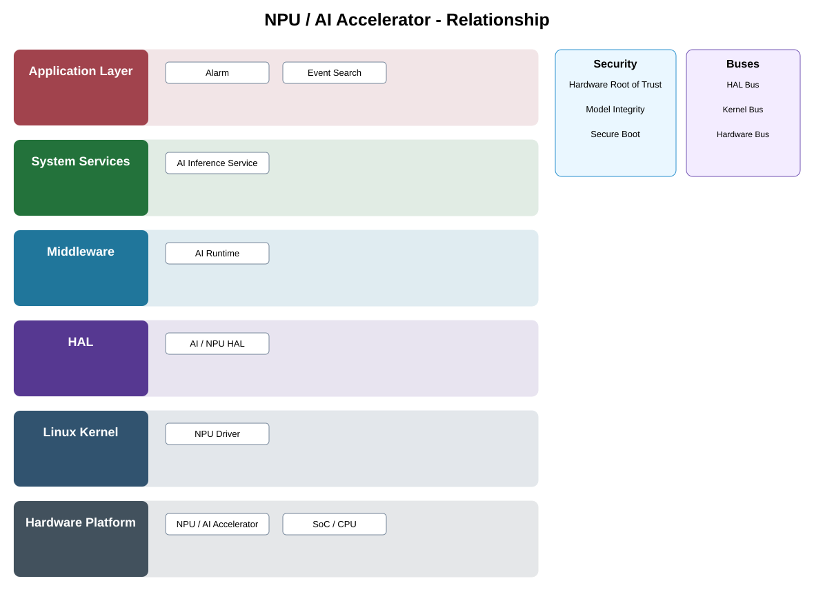

# NPU / AI Accelerator Detailed Design

## Component
`npu_ai_accelerator`

## Purpose
Provides dedicated hardware acceleration for machine-learning inference workloads used by approved AI services.

## Relationship overview

## Relevant system path

### Application Layer
- Alarm
- Event Search
### System Services
- AI Inference Service
### Middleware
- AI Runtime
### HAL
- AI / NPU HAL
### Linux Kernel
- NPU Driver
### Hardware Platform
- NPU / AI Accelerator
- SoC / CPU

## Security context
- Hardware Root of Trust
- Model Integrity
- Secure Boot

## Communication boundaries
- HAL Bus
- Kernel Bus
- Hardware Bus

## Dependency rules
- Hardware is consumed only through approved kernel/HAL/service abstractions.
- Platform-specific behavior shall not leak into upper-layer application APIs.
- Security and lifecycle controls remain active across reset and power transitions.

## Failure behavior
- accelerator unavailable
- thermal limit
- reset failure

## Changelog
- 2026-10-03: Added detailed relationship design.
